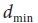
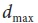
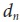
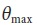

## [П]|[РС]|(РП) Упражнения

1. Пренебрегая шумами на изображении при применении алгоритма IPAN будут ли возвращены те же "доминирующие точки" после изменения размеров объекта? После разворота объекта?

	a. Причины такого ответа

	b. А теперь попробуйте следующее. В PowerPoint или аналогичной программе нарисуйте объект "интересной" формы белым цветом на черном фоне. Поместите нарисованный объект на исходном изображении. Сохраните несколько вариантов полученного изображения, изменяя размеры и поворот объекта. Затем загрузите весь набор изображений в программу, конвертируйте в оттенки серого, примените пороговое преобразование и найдите контур. Используя функцию *cvFindDominantPoints()*, найдите доминирующие точки на изображениях, в которых производились изменения объекта. Совпадают ли найденные точки?

2. Поиск экстремальных точек (т.е. двух точек максимально удаленных друг от друга) в замкнутом контуре из N точек может происходить путем сравнения расстояния между каждой из точек контура с любой другой точкой контура. 

	a. В чем сложность такого алгоритма?

	b. Предложите идею по ускорению его работы?

3. Создайте очередь изображения круга, используя функцию *CvSeq*.

4. Чему равна максимальная длина замкнутого контура, который ограничен изображением 4x4? Чему равна площадь такого контура?

5. Используя PowerPoint или подобную программу, нарисуйте белый круг радиусом 20 на черном фоне (длина окружности 2 π 20 ≈ 126.7). Сохраните полученное изображение.

	a. Загрузите изображение в программу, конвертируйте в оттенки серого, примените пороговое преобразование и найдите контур. Чему равна длина контура? Полученное значение равно (в пределах округления) рассчитанному значению?

	b. Используя значение 126.7 в качестве базовой длины контура, примените *cvApproxPoly()* со следующими значениями параметров: 90, 66, 33, 10. Определите длину контура и отобразите результат.

6. Используя нарисованный круг из 5 упражнения, исследуйте следующие результаты функции *cvFindDominantPoints()*.

	a. Переменные расстояния  и .

	b. Теперь измените переменную расстояния до соседей  и опишите произошедшие изменения.

	c. Теперь измените переменную максимального угла  и опишите результат.

7. Поиск угла субпикселя. Создайте белый на черном фоне угол в PowerPoint (или подобной программе) так, чтобы координаты угла были целыми значениями. Сохраните полученное изображение и загрузите в программу. 

	a. Найдите и распечатайте точные координаты угла.

	b. Измените исходное изображение: удалите кончик угла при помощи небольшого черного круга. Сохраните изображение и найдите координаты угла субпикселя. Это те же координаты? Почему да или почему нет?

8. Допустим необходимо построить детектор бутылки и создать "бутылочные" признаки. Например, имеется изображение с множеством бутылок на сцене, которые легко сегментировать и найти для них контур, однако, бутылки могут быть повернуты и иметь различные размеры. Можно нарисовать контуры и найти Hu моменты для получения инвариантного вектора. Уже не плохо, но что необходимо использовать далее – заполненный контур или просто линию контура? Поясните свой ответ.

9. Какое значение нужно установить для *isBinary* при использовании *cvMoments()* для извлечения моментов контуров бутылок из упражнения 8?

10. В данном упражнении воспользуйтесь буквами, используемые при обсуждении Hu моментов. Сгенерируйте несколько вариантов этих букв за счет их вращения, масштабирования и одновременного вращения, и масштабирования. Опишите результаты воздействия этих операций на Hu моменты.

11. Нарисуйте объект простой формы в PowerPoint (или другой аналогичной программе) и сохраните его в виде изображения. Затем сгенерируйте варианты данного изображения за счет вращения, масштабирования и одновременного вращения, и масштабирования объекта. Сравните полученные изображения при помощи *cvMatchContourTrees()* и *cvConvexityDefects()*. Какая из функций лучше сравнивает объекты? Почему?