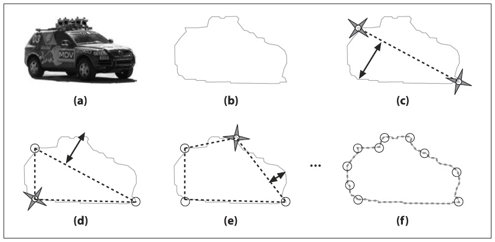
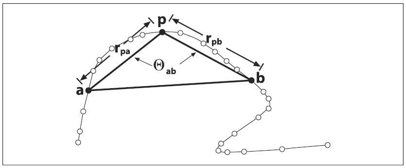
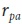
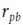
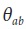
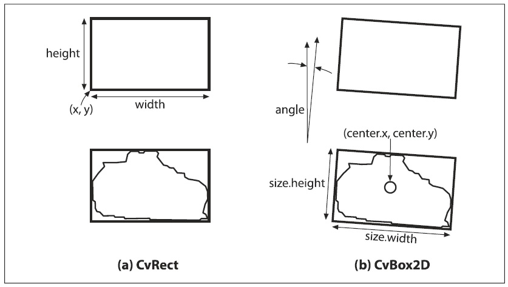
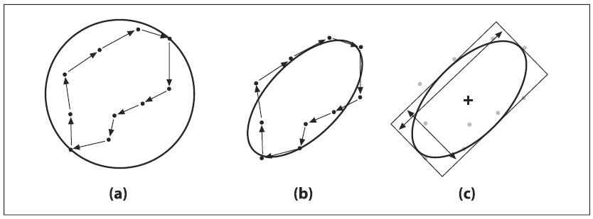

## [П]|[РС]|(РП) Другие манипуляции с контурами

Во время анализа изображения можно производить множество различных вещей с контурами. В конце концов, большинство контуров являются тем, что интересно идентифицировать и манипулировать. Различные вариационные задачи включают в себя конкретизацию контуров различными путями, их упрощение или приближение, сопоставление их с шаблонами и так далее.

В этом разделе будут рассмотрены некоторые из этих задач и различные функции OpenCV, которые либо выполняют некоторые вещи за нас, либо предоставляют некоторый функционал для упрощения наших задач.

### Полигон приближений

Если необходимо нарисовать контур или проанализировать его форму, то полигон приближений является обобщенным приближением контура, представляющий из себя многоугольник с другим контуром, имеющий меньшее количество вершин. Есть несколько способов получения такого полигона; OpenCV предоставляет один из возможных вариантов (если быть более точными, то OpenCV реализует алгоритм приближения Douglas-Peucker; другими наиболее популярными являются алгоритмы Rosenfeld-Johnson и Teh-Chin). Функция *cvApproxpoly()* реализует алгоритм, который работает с последовательностью контуров:

```cpp
	CvSeq* cvApproxPoly(
		 const void* 	src_seq
		,int 			header_size
		,CvMemStorage* 	storage
		,int 			method
		,double 		parameter
		,int 			recursive = 0
	);
```

Данной функции можно передать последовательность контуров в виде списка или дерева, при этом обработки подвергнутся все контуры последовательности. Функция возвращает указатель на первый контур последовательности, для перехода к другим контурам можно воспользоваться *h_next* (или *v_next*).

Т.к. функция возвращает указатель на создаваемые ею объекты, то ей необходимо передавать указатель на *CvMemStorage* и размер заголовка (как правило, он равен sizeof(*CvContour*)).

Аргумент *method* всегда имеет значение *CV_POLY_APPROX_DP* (хотя существует возможность выбора иного алгоритма при их появлении). Следующие два аргумента специфичны для метода (из которых на момент написания книги существует только один). Аргумент *parameter* задает точность для алгоритма. Для понимания работы данного аргумента необходимо рассмотрение конкретного алгоритма (если это достаточно сложно, просто установите этот параметр в малую часть от общей длины кривой). Последний аргумент указывает на необходимость применения алгоритма к каждому контуру, к которым можно получить доступ с помощью указателей *h_next* или *v_next*. Если этот аргумент имеет значение 0, то только контур, на который указывает *src_seq*, подвергнется приближению.

Теперь рассмотрим, как работает алгоритм, заложенный в данную функцию. На рисунке 8-5, начиная с контура *a* (часть *b*) алгоритм выбирает две точки экстремума и соединяет их линией (часть *c*). Затем в исходном многоугольнике ищется наиболее удаленная точка от этой линии, и эта точка добавляется к приближению. Процесс повторяется (часть *d*), добавляя следующую наиболее удаленную точку к накопительному приближению, пока все точки меньшие расстояния, указанного в параметре *precision* не будут добавлены (часть *f*). Это означает, что хорошими кандидатами для параметра будут точки на некотором отрезке контура или на ограниченном (ROI) участке контура или что-то соизмеримое с контуром. 



Рисунок 8-5. Наглядное представление алгоритма DP, используемого в cvApproxPloy(): для исходного изображения (a) выполняется аппроксимация контура (b), с последующим, начиная с первых максимально отдаленных друг от друга вершин (c), отбором максимально отдаленных вершин от линии, соединяющей две вершины (d-f)

С только что описанным приближением тесно связан процесс нахождения доминирующих точек. *Доминирующая точка* определяется как точка, которая имеет наибольшее количество информации в сравнении с другими точками кривой. Доминирующие точки используются во многих ситуациях, схожих с полигоном приближений. Функция *cvFindDominantPoints()* реализует так называемый алгоритм *IPAN* (Image and Pattern Analysis Group, венгерская академия наук; алгоритм зачастую упоминается как IPAN99, т.к. впервые он был опубликован в 1999 году). 

```cpp
	CvSeq* cvFindDominantPoints(
		 CvSeq* 		contour
		,CvMemStorage* 	storage
		,int 			method = CV_DOMINANT_IPAN
		,double 		parameter1 = 0
		,double 		parameter2 = 0
		,double 		parameter3 = 0
		,double 		parameter4 = 0
	);
```

По сути, алгоритм IPAN пытается построить треугольники на внутренней кривой с помощью доступных вершин, путем сканирования вдоль контура. Треугольник характеризуется размером и углом раскрытия (рисунок 8-6). Точки с большими углами раскрытия сохраняются при условии, что их размеры меньше указанного глобального порога и меньше своих соседей.



Рисунок 8-6. Алгоритм IPAN использует треугольник abp для конкретизации точки p

Первые два аргумента функции *cvFindDominantPoints()* *CvSeq** и *CvMemStorage** это последовательность контуров и хранилище соответственно. Следующий аргумент *method* на момент написания книги имеет одно единственное значение *CV_DOMINANT_IPAN*.

Следующие четыре аргумента: минимальное расстояние , максимальное расстояние , расстояние до соседей  и максимальный угол . Как показано на рисунке 8-6 алгоритм вначале строит все треугольники для которых  и  находятся между  и  и для которых  < . На следующем втором проходе сохраняются только точки *p* с наименьшим значением связывания  в окрестности  (значение  никогда не должно превышать ). Типичное значение для , ,  и : 7, 9, 9, 150 (угол измеряется в градусах).

### Сводная характеристика

Другая задача, с которой часто приходиться сталкиваться при работе с контурами - это вычисление различных характеристик контура. Это может быть длина или форма контура. Другой полезной характеристикой является момент контура, который может быть использован для обобщения формы контура (об этом пойдет речь в следующем разделе)

**Длина**

Функция *cvContourPerimeter()* принимает контур, а возвращает его длину. На самом деле эта функция - макрос для более обобщенной функции *cvArcLength()*.

```cpp
	double cvArcLength(
		 const void* 	curve
		,CvSlice 		slice 		= CV_WHOLE_SEQ
		,int 			is_closed 	= -1
	);

#define cvContourPerimeter( contour ) cvArcLength( contour, CV_WHOLE_SEQ, 1 )
```

Первый аргумент *cvArcLength()* это контур, который может быть представлен последовательностью точек (*CvContour** или *CvSeq**) или *nx2* массивом точек. Далее следует аргумент *slice* и логический аргумент, указывающий должен ли быть контур закрытым (т.е. рассматривать последнюю точку как связанную с первой). Аргумент *slice* позволяет выбирать некоторое подмножество точек на кривой. (Почти всегда используется *CV_WHOLE_SEQ*. Структура *CvSlice* содержит только два элемента: *start_index* и *end_index*. Так же существует возможность создавать собственный *slice* и передать его функции при помощи вспомогательной функции *cvSlice( int start, int end )*).

С функцией *cvArcLength()* тесно связана функция *cvContourArea()*, которая (как видно из названия) вычисляет площадь контура. Функция принимает два аргумента *contour* и *slice*. 

```cpp
	double cvContourArea(
		 const CvArr* 	contour
		,CvSlice 		slice = CV_WHOLE_SEQ
	);
```

**Ограничительная рамка**

Конечно, длина и площадь просто характеризует контур. Следующий уровень детализации может быть представлен ограничительной рамкой или ограничительным кругом или эллипсом. Рамку можно реализовать двумя способами, а круг или эллипс только одним.

```cpp
	CvRect cvBoundingRect(
		 CvArr* 	points
		,int 		update = 0
	);

	CvBox2D cvMinAreaRect2(
		 const CvArr* 	points
		,CvMemStorage* 	storage = NULL
	);
```

Наиболее простой способ получения рамки - это использовать функцию *cvBoundingRect()*, которая возвращает структуру типа *CvRect*. Аргумент *points* может быть контуром (*CvContour**) или *nx1* двухканальным массивом (*CvMat**), содержащий последовательность точек. Что касается второго аргумента *update*, то необходимо помнить, что *CvContour* это не совсем то же самое, что *CvSeq*; функциональность *CvContour* шире. Одним из дополнений *CvContour* является поле типа *CvRect*, которое задает собственную ограничительную рамку. Если вызвать *cvBoundingRect()* с *update = 0*, то будет возвращено значение того самого дополнительного поля; но если *update = 1*, ограничительная рамка будет вычислена (и собственная ограничительная рамка структуры *CvContour* будет установлена в это вычисленное значение).

Однако есть одна проблема, связанная с *cvBoundingRect()* - при помощи *CvRect* можно представить только прямоугольник, стороны которого ориентированы по горизонтали и вертикали. А вот *cvMinAreaRect2()* возвращает минимальный прямоугольник, содержащий контур, и самое главное позволяет наклонять этот прямоугольник по вертикали (рисунок 8-7). Аргументы этой функции схожи с аргументами *cvBoundingRect()*. Для представления подобного рода прямоугольников в OpenCV есть соответствующий тип *CvBox2D*.

```cpp
	typedef struct CvBox2D
		CvPoint2D32f 	center;
		CvSize2D32f 	size;
		float 			angle;
	} CvBox2D;
```



Рисунок 8-7. При помощи CvRect можно представить только вертикальный прямоугольник, а при помощи CvBox2D можно представлять прямоугольники любого наклона

**Ограничительные круги и эллипсы**

Теперь рассмотрим функцию *cvMinEnclosingCircl()*. Эта функция работает почти так же, как и предыдущая; множество *points* может быть последовательностью или двухмерным массивом точек.

```cpp
	int cvMinEnclosingCircle(
		 const CvArr* 	points
		,CvPoint2D32f* 	center
		,float* 		radius
	);
```

Так как в OpenCV нет специальной структуры, представляющей круги, то в функцию необходимо передавать указатель центральной точки *center* и указатель типа *float** для указания радиуса. 

Помимо установки ограничительного круга, OpenCV предоставляет функцию для установки ограничительного эллипса:

```cpp
	CvBox2D cvFitEllipse2(
		const CvArr* 	points
	);
```

Тонкая разница между *cvMinEnclosingCircle()* и *cvFitEllipse2()* состоит в том, что первая функция вычисляет наименьший круг, который полностью охватывает заданный контур, в то время как последняя использует функции подгонки и возвращает эллипс, который является наилучшим приближением к контуру. Это означает, что не все точки контура будут включены в эллипс, возвращаемый *cvFitEllipse2()*. Подгонка производится методом наименьших квадратов.

Результат подгонки возвращается в виде структуры *CvBox2D*, которая точно охватывает эллипс (рисунок 8-8).



Рисунок 8-8. Контур из 10 точек с наименьшим ограничивающим кругом (a) и с наиболее подходящим эллипсом (b); рамка (c) используется для представления этого эллипса

### Геометрия

Когда доходит дело до ограничительной рамки и других полигонов контура, зачастую бывает нужно выполнить такие простые геометрические проверки, как перекрытие полигонов или прямоугольников. OpenCV предлагает небольшой, но довольно таки удобный набор функций для такого рода геометрических проверок. 

```cpp
	CvRect cvMaxRect(
		 const CvRect* 	rect1
		,const CvRect* 	rect2
	);

	void cvBoxPoints(
		 CvBox2D 		box
		,CvPoint2D32f 	pt[4]
	);

	CvSeq* cvPointSeqFromMat(
		 int 			seq_kind
		,const CvArr* 	mat
		,CvContour* 	contour_header
		,CvSeqBlock* 	block
	);

	double cvPointPolygonTest(
		 const CvArr* 	contour
		,CvPoint2D32f 	pt
		,int 			measure_dist
	);
```

Первая функция *cvMaxRect()* вычисляет новый прямоугольник на основе двух входных. Новый меньший прямоугольник связывает оба входных прямоугольника.

Следующая функция *cvBoxPoints()* просто вычисляет точки в углах структуры *CvBox2D*. Данное вычисление можно произвести и самостоятельно, используя тригонометрию, однако это довольно таки утомительно. 

Следующая функция *cvPointSeqFromMat()*, генерирует структуру последовательности из матрицы. Это бывает полезным, когда необходимо использовать функции для работы с контурами, которые не принимают матрицы в качестве аргументов. Первый аргумент используется для указания типа последовательности, которую необходимо получить. Переменная *seq_kind* может быть установлена в одно из следующих значений: 0 - простой набор точек; *CV_SEQ_KIND_CURVE* - последовательность должна представлять кривую; *CV_SEQ_KIND_CURVE | CV_SEQ_FLAG_CLOSED* - последовательность должная быть замкнутой кривой. Следующий аргумент *nx1* массив точек. Точки должны быть типа *CV_32SC2* или *CV_32FC2* (т.е. массив должен быть двухканальным и состоять из одного столбца). Следующие два аргумента - указатели на значения, которые будут вычисляться в функции, где *contour_header* - структура контура, которая должна быть создана перед вызовом функции, а заполнена во время выполнения функции. Для аргумента *block* идея та же. (Как правило, *block* это мало используемая переменная. Она существует, потому что никакой памяти при вызове cvPointSeqFromMat() не копируется; вместо этого, создается "виртуальный" блок памяти, указывающий на предоставленную матрицу. Переменная *block* используется для создания ссылки на эту память для соответствующей внутренней последовательности или рассчитываемого контура).

Возвращаемым значение будет указатель *CvSeq**, который на самом деле указывает на саму структуру контура, переданную перед вызовом функции. Это удобно, потому что обычно необходим адрес последовательности во время вызова функций, работающих с последовательностями и требующие выполнять эти преобразования в первую очередь.

Последняя функция из набора *cvPointPolygonTest()* позволяет проверять попадание точки внутрь многоугольника (представленного последовательностью). В частности, если аргумент *measure_dist* имеет не нулевое значение, тогда функция возвращает расстояние до ближайшего края контура; это расстояние равно 0, если точка находится внутри контура, иначе это значение будет положительным, а точка будет находиться за пределами контура. Если аргумент *measure_dist* равен 0, то возвращаемым значением будет +1, -1 или 0 в зависимости от того, где находится точка: внутри, снаружи или на краю (или на вершине) соответственно. Контур может быть представлен последовательностью или *nx1* двухканальной матрицей точек.