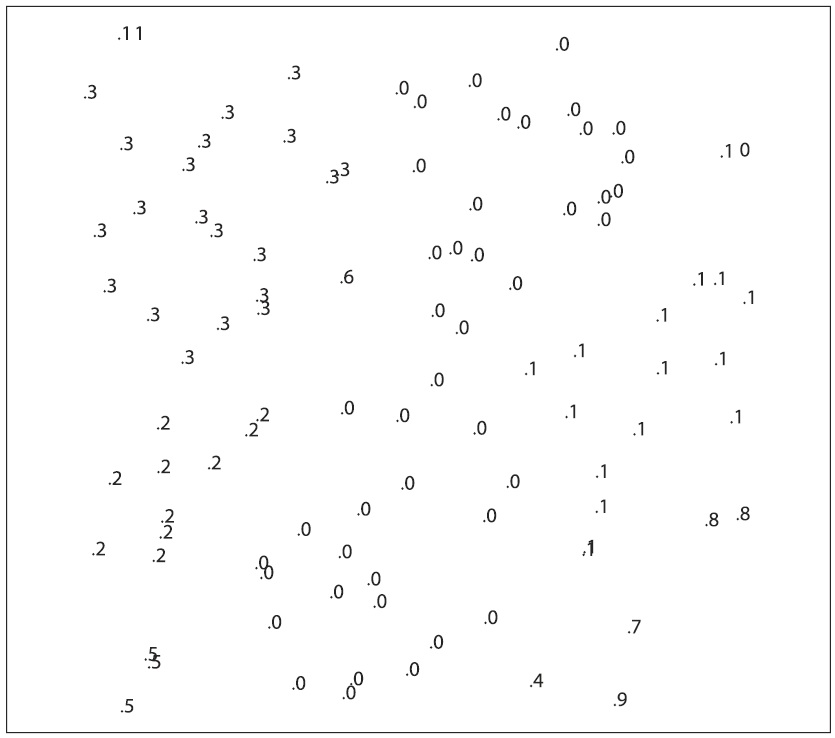

## (П]|(РС]|(РП) Последовательности

Одним из типов объектов, который может хранить хранилище является *последовательность*. Последовательности – это самостоятельно связанные списки разных структур. OpenCV может сделать последовательность из множества различных объектов. В этом смысле можно думать о последовательности как о нечто похожим на общий контейнер классов (или шаблон контейнера классов), который существует в различных языках программирования. Конструкция последовательности в OpenCV выглядит в виде симметричной очереди, так что это позволяет быстро получать произвольный доступ и добавлять/удалять объекты с любого конца очереди, но при этом немного медленнее в случае добавления и удаления объектов в середину очереди. 

Непосредственно внутри самой структуры (пример 8-1) есть некоторые важные элементы, о которых необходимо знать. Во-первых, чаще всего будет использоваться элемент *total*. Это общее количество точек или объектов в последовательности. Следующими четырьмя важными элементами являются указатели на другие последовательности: *h_prev*, *h_next*, *v_prev* и *v_next*. Эти четыре указателя являются частью так называемого элемента *CV_TREE_NODE_FIELDS*; они используются не для указания на элемент последовательности, они нужны для соединения различных последовательностей друг с другом. Другие объекты OpenCV так же содержат эти поля узлов дерева. Любые такие объекты могут быть собраны при помощи этих указателей в более сложные супер структуры такие, как списки, деревья и графы. Переменные *h_prev* и *h_next* могут быть использованы для создания простого связного списка. Другие две переменные *v_prev* и *v_next* могут быть использованы для создания более сложной топологии, которая связывает узлы друг с другом. Именно с помощью этих четырех указателей функция *cvFindContours() * способна представить все найденные контуры, составленные в сложную структуру в виде дерева контуров.

Пример 8-1. Внутренняя организация структуры последовательности CvSeq

```cpp
typedef struct CvSeq {
	int 			flags; 			// различные флаги
	int 			header_size; 	// размер заголовка последовательности
	CvSeq* 			h_prev; 		// горизонтально-предыдущая последовательность
	CvSeq* 			h_next; 		// горизонтально-следующая последовательность
	CvSeq* 			v_prev; 		// вертикально-предыдущая последовательность
	CvSeq* 			v_next 			// вертикально-следующая последовательность
	int 			total; 			// общее количество элементов
	int 			elem_size; 		// размер элемента последовательности в байтах
	char* 			block_max; 		// максимальный предел последнего блока
	char* 			ptr; 			// текущий указатель записи
	int 			delta_elems; 	// сколько элементов выделять при росте последовательности
	CvMemStorage* 	storage; 		// где хранить последовательность
	CvSeqBlock* 	free_blocks; 	// список свободных блоков
	CvSeqBlock* 	first; 			// указатель на первый блок последовательности
}
```

### Создание последовательности

Как уже было сказано ранее, многие функции OpenCV могут возвращать последовательности. В добавок к этому существует возможность создавать собственные последовательности. Как и для большинства объектов OpenCV, существует функция создающая последовательности и возвращающая указатель на эту последовательность. Эта функция называется *cvCreateSeq()*:

```cpp
	CvSeq* cvCreateSeq(
		 int 			seq_flags
		,int 			header_size
		,int 			elem_size
		,CvMemStorage* 	storage
	);
```

Эта функция запрашивает некоторые дополнительные флаги, которые указывают какая именно последовательность создается. Кроме того необходимо указывать размер заголовка последовательности (всегда *sizeof(CvSeq)*) и размеры объектов, которые содержит последовательность. И наконец, необходимо хранилище, которое будет использовано для выделения памяти под последовательность при добавлении нового элемента в последовательность.

Флаги *flags* бывают трех различных категорий и могут быть объединены с помощью оператора побитового *OR*. Первая категория определяет тип объектов из которых будет создана последовательность (Типы в данной категории используются редко. Чтобы создать последовательность, элементами которой являются кортежи чисел, нужно использовать *CV_32SC2*, *CV_32FC4* и т.д. Для создания последовательности элементов собственного типа, необходимо передать 0 и указать правильный размер *elem_size*). Многие из этих типов могут быть не знакомыми, а некоторые в первую очередь предназначены для других функций OpenCV. К тому же некоторые флаги имеет смысл использовать только с определенными типами последовательностей (например, *CV_SEQ_FLAG_CLOSED* имеет смысл использовать только для последовательностей, представляющие многоугольники)

```cpp
	CV_SEQ_ELTYPE_POINT
		(x,y)

	CV_SEQ_ELTYPE_CODE
		Код Freeman: 0..7

	CV_SEQ_ELTYPE_POINT
		Указатель на точку: &(x,y)

	CV_SEQ_ELTYPE_INDEX
		Целочисленный индекс точки: #(x,y)

	CV_SEQ_ELTYPE_GRAPH_EDGE
		&next_o,&next_d,&vtx_o,&vtx_d
	
	CV_SEQ_ELTYPE_GRAPH_VERTEX
		first_edge, &(x,y)
	
	CV_SEQ_ELTYPE_TRIAN_ATR
		Вершина бинарного дерева
	
	CV_SEQ_ELTYPE_CONNECTED_COMP
		Связная компонента
	
	CV_SEQ_ELTYPE_POINT3D
		(x,y,z)
```

Вторая категория указывает на характер последовательности, который может быть любым из ниже перечисленных.

```cpp
	CV_SEQ_KIND_SET
		Множество объектов
	
	CV_SEQ_KIND_CURVE
		Кривая определенная объектами
	
	CV_SEQ_KIND_BIN_TREE
		Бинарное дерево объектов

	CV_SEQ_KIND_GRAPH
		Граф с объектами в узле
```

Третья категория состоит из флагов, которые указывают некоторые дополнителные свойства последовательности

```cpp
	CV_SEQ_FLAG_CLOSED
		Закрытая последовательность (многоугольники)
	
	CV_SEQ_FLAG_SIMPLE
		Простая последовательность (многоугольники)
	
	CV_SEQ_FLAG_CONVEX
		Выпуклая последовательность (многоугольники)
	
	CV_SEQ_FLAG_HOLE
		Вогнутая последовательность (многоугольники)
```

### Удаление последовательности

```cpp
	void cvClearSeq(
		 CvSeq* seq
	);
```

Для удаления последовательности можно использовать функцию *cvClearSeq()*, которая очистит все элементы последовательности. Однако, эта функция не возвращает хранилищу или системе выделяемые под них блоки; память, выделенная последовательностью может быть повторно использована только этой же последовательностью. Если необходимо использовать память для других целей, необходимо очистить память хранилища при помощи *cvClearMemStore()*.

### Прямой доступ к элементам последовательности

Зачастую будет возникать необходимость прямого доступа к конкретному элементу последовательности. Есть несколько способов сделать это, однако, самый прямой и правильный путь получения доступа к случайно выбранному элементу () использовать *cvGetSeqElem()*.

```cpp
	char* cvGetSeqElem( seq, index )
```

Часто будет возникать необходимость приводить возвращаемый указатель к любому из типов, из которых может состоять последовательность. Следующий пример показывает как с помощью *cvGetSeqElem()* распечатать элементы последовательности точек (могут быть возвращены функцией *cvFindContours()*, которая будет рассмотрена чуть позже): 

```cpp
	for( int i=0; i<seq->total; ++i ) {
		CvPoint* p = (CvPoint*)cvGetSeqElem ( seq, i );
		printf("(%d,%d)\n", p->x, p->y );
	}
```

В добавок к этому при помощи функции *cvSeqElemIdx* можно узнать где в последовательности расположен конкретный элемент:

```cpp
	int cvSeqElemIdx(
		const CvSeq* 	seq
		const void* 	element
		CvSeqBlock** 	block = NULL
	);
```

Выполнение данной функции занимает некоторое время, так что это не очень эффективная операция (время поиска пропорционально количеству элементов в последовательности). Стоит обратить внимание на то, что *cvSeqElemIdx()* принимает в качестве аргумента указатель на последовательность и указатель на элемент, который ищется. (Правильнее было бы сказать, что *cvSeqElemIdx()* принимает разыскиваемый указатель. Так происходит потому-что cvSeqElemIdx() не ищет элемент в последовательности который равен **element*, а скорее ищет элемент который находится на месте *element*) Так же можно передать указатель на блок памяти последовательности. Если *block != NULL*, тогда будет возвращено расположение блока в котором был найден элемент последовательности. 

### Деление на части, копирование и перемещение данных

Последовательности можно копировать при помощи функции *cvCloneSeq()*, которая выполняет глубокое копирование последовательности, создавая совершенно новую последовательность.

```cpp
	CvSeq* cvCloneSeq(
		 const CvSeq* 	seq
		,CvMemStorage* 	storage = NULL
	)
```

На самом деле эта функция является "оберткой" для более общей функции *cvSeqSlice()*. Эта функция может "вытащить" часть массива, выполнить глубокое копирование или же просто создать новый заголовок для создания альтернативного "представления" на те же данные.

```cpp
	CvSeq* cvSeqSlice(
		 const CvSeq* 	seq
		,CvSlice 		slice
		,CvMemStorage* 	storage 	= NULL
		,int 			copy_data 	= 0
	);
```

Как можно было бы заметить аргумент *slice* имеет тип *CvSlice*. Фрагмент (slice) может быть определен с помощью вспомогательной функции *cvSlice(a, b)*, либо с помощью макроса *CV_WHOLE_SEQ*. В первом случае, в копию будут включены только элементы начиная с *a* и до *b* (*b* так же может быть установлено в *CV_WHOLE_SEQ_END_INDEX*, чтобы указать конец массива). Аргумент *copy_data* определяет будет ли выполняться "глубокое" копирование (т.е. необходимо ли копировать все элементы данных в новую последовательность).

Фрагменты могут быть использованы для удаления части элементов последовательности с помощью функции *cvSeqRemoveSlice()*, либо для вставки в последовательность при помощи *cvSeqInsertSlice()*.

```cpp
	void cvSeqRemoveSlice(
		 CvSeq* 	seq
		,CvSlice 	slice
	);

	void cvSeqInsertSlice(
		 CvSeq* 		seq
		,int 			before_index
		,const CvArr* 	from_arr
	);
```

С введением функции сравнения так же появляется возможность сортировки и поиска (в отсортированной) последовательности. Функция сравнения должна иметь следующий прототип:

```cpp
	typedef int (*CvCmpFunc)(const void* a, const void* b, void* userdata );
```

*a* и *b* являются указателями на элементы сортируемого типа, *userdata* - указатель на дополнительные структуры данных, которые вызывают сортировку или поиск во время выполнения. Функция сравнения возвращает -1, если больше *b*, +1, если меньше *b* и 0, если *a* и *b* равны.

При такой функции сравнения последовательность может быть отсортирована с помощью *cvSeqSort()*. Найти элемент *elem* последовательности (или указатель на него) можно при помощи *cvSeqSearch()*. Поиск занимает O(log n) времени, если последовательность уже отсортирована (*is_sorted = 1*). Если последовательность не отсортирована, тогда функция сравнения не нужна и поиск займет O(n) времени. По завершении поиска **elem_idx* будет установлен в индекс найденного элемента (если он был найден) и функция вернет указатель на этот элемент. Если элемент не найден, тогда функция вернет NULL.

```cpp
	void cvSeqSort(
		 CvSeq* 	seq
		,CvCmpFunc 	func
		,void* 		userdata = NULL
	);

	char* cvSeqSearch(
		 CvSeq* 		seq
		,const void* 	elem
		,CvCmpFunc 		func
		,int 			is_sorted
		,int* 			elem_idx
		,void* 			userdata = NULL
	);
```

Последовательность может быть инвертирована с помощью функции *cvSeqInvert()*. Эта функция не изменяет сами данные, но она реорганизует последовательность так, что элементы в ней переставляются в обратном порядке.

```cpp
	void cvSeqInvert(
		 CvSeq* 	seq
	);
```

OpenCV так же поддерживает метод разделения последовательности на основе пользовательского критерия через функцию *cvSeqPartition()*. Для разделения используется та же функция сравнения описанная выше, но с предположением, что функция будет возвращать ненулевое значение, если два аргумента равны и 0 если они не равны (т.е. в противоположность функции сортировки и поиска).

```cpp
	int cvSeqPartition(
		 const CvSeq* 	seq
		,CvMemStorage* 	storage
		,CvSeq** 		labels
		,CvCmpFunc 		is_equal
		,void* 			userdata
	);
```

Для обеспечения процесса разделения выделяется память хранилища. Аргумент *labels* должен быть указателем на последовательность указателей. После выполнения *cvSeqPartition()* результатом будет то, что *labels*, будет указывать на последовательность целых чисел, которые имеют взаимно-однозначнео соответствие с элементами разделённой последовательности *seq*. Значения этих чисел начинаются с нуля и увеличиваются, "имена" разделов теже, что у точек в *seq*, к которым они присоединены. Указатель *userdata* прозрачно передается функции сравнения.

На рисунке 8-1, группа из 100 точек хаотично распределена на холсте размером 100x100. Затем вызывается функция сравнения *cvSeqPartition()* для этих точек, основанная на Евклидоом расстоянии. Функция возвращает *true* (1), если расстояние меньше 5 и *false* (0) в противном случае. Полученные кластеры помечаются целыми порядковыми номерами из *labels*.



Рисунок 8-1. Последовательность из 100 точек на холсте 100x100, разделенная расстоянием D <= 5

### Использование последовательности как стек

Как отмечалось ранее, последовательность в OpenCV - это связный список. Это означает, что последовательность может быть одинаково эффективно доступна с обоих концов. Как результат, последовательность может быть использована в качестве стека. Следующие шесть функций в сочетании со структурой *CvSeq* могут реализовать поведение, необходимое для использования последовательности в качестве стека (а если точнее, то в качестве очереди, т.к. функции позволяют получать доступ к обоим концам списка).

```cpp
	char* cvSeqPush(
		 CvSeq* 	seq
		,void* 		element = NULL
	);
	 
	char* cvSeqPushFront(
		 CvSeq* 	seq
		,void* 		element = NULL
	);
	 
	void cvSeqPop(
		 CvSeq* 	seq
		,void* 		element = NULL
	);
	 
	void cvSeqPopFront(
		 CvSeq* 	seq
		,void* 		element = NULL
	);
	 
	void cvSeqPushMulti(
		 CvSeq* 	seq
		,void* 		elements
		,int 		count
		,int 		in_front = 0
	);
	 
	void cvSeqPopMulti(
		 CvSeq* 	seq
		,void* 		elements
		,int 		count
		,int 		in_front = 0
	);
```

Основные режимы доступа к последовательности осуществляются через *cvSeqPush()*, *cvSeqPushFront()*, *cvSeqPop()* и *cvSeqPopFront()*. Послкольку все эти функции работают с окончанием последовательности, на выполнение зтрачивается O(l) времени (т.е. нет зависимости от размера последовательности). *Push* функции возвращают аргумент элементу, помещенному в последовательность, а *Pop* функции дополнительно сохраняют "выброшенный" элемент, если предоставлен указатель расположения, куда объект может быть скопирован. 

Функции *cvSeqPushMulti()* и *cvSeqPopMulti()* записывают или извлекают из последовательности одновременно несколько элементов. Обе функции принимают дополнительный аргумент, чтобы различать начало и конец; можно установить in_front либо в *CV_FRONT* (1) либо в *CV_BACK* (0), тем самым определить откуда 
будут извлекаться или записываться элементы.

### Добавление и удаление элементов

```cpp
	char* cvSeqInsert(
		 CvSeq* 	seq
		,int 		before_index
		,void* 		element = NULL
	);

	void cvSeqRemove(
		 CvSeq* 	seq
		,int 		index
	);
```

объекты могут быть добавлены в и удалены из середины последовательности при помощи функций *cvSeqInsert()* и *cvSeqRemove()*, соответственно, при этом стоит не забывать о том, что это не очень быстро. В среденм это занимает время, пропорциональное общему размеру последовательности.

### Размер блока последовательности

*cvSetSeqBlockSize()* это одна из функций, цель которой может быть не очевидной на первый взгляд. Эта функция в качестве аргумента принимает последовательность и новый размер блока, под блоки будет выделена память из хранилища при появлении новых элементов последовательности. Увеличение размера блока может привести к разрыву последовательности поперек разъединенных блоков памяти; уменьшение размера блока может привести к утечке памяти. По умолчанию размер блока составляет 1000 байтов, но это значение может быть изменено в любое время. (Начиная с 5 beta версии OpenCV, этот размер автоматически увеличивается, если последовательность увеличивается, поэтому не стоит беспокоиться об этом при обычных условиях)

```cpp
	void cvSetSeqBlockSize(
		 CvSeq* 	seq
		,Int 		delta_elems
	);
```

### Чтение и запись последовательности

