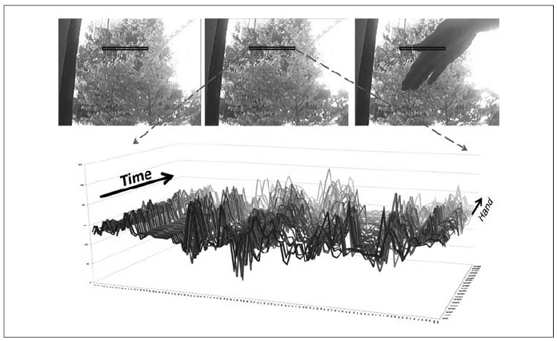
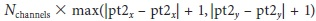
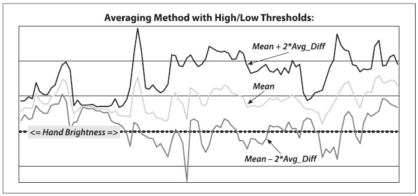
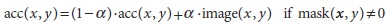
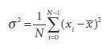
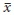
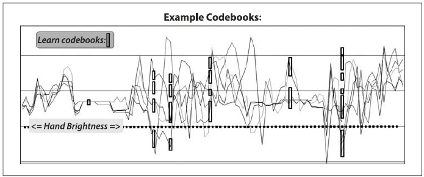

## (П]|(РС)|(РП) Исключение фона

Из-за своей простоты и т.к. камера, как правило, зафиксирована, *исключение фона*, вероятно, наиболее фундаментальная операция обработки изображения из видеопотока для обеспечения безопасности. Для выполнения исключения фона для начала необходимо "изучить" модель фона. Однажды изученная *модель фона* сравнивается с текущим изображением с последующим исключением известных частей фона. Объекты, оставшиеся после исключения, предположительно будут являться новыми объектами переднего плана.

Конечно, "фон" является плохо определенным понятием, которое изменяется в зависимости от применения. Например, в случае рассмотрения шоссе, возможно, обычный транспортный поток следует считать фоном. Как правило, за фон принимаются любые статические или периодически движущие части сцены, которые остаются неизменными или периодическими в течение интересующего периода. Группа может иметь изменяющиеся во времени компоненты, такие как деревья, которые развиваются от ветра утром и вечером, но неподвижны в полдень. Две распространённые, но существенно различающиеся категории окружения, которые могут встретиться, это сцены внутри и снаружи помещений. Возникает интерес в инструментах, которые помогут в обеих категориях окружения. Вначале будут рассмотрены недостатки типичных моделей фона, а затем будут рассмотрены модели сцен высших порядков. Далее будет представлен быстрый метод, который в основном хорош для статичных фоновых сцен внутри помещений, освещение которых практически не меняется. Затем будет рассмотрен метод "кодовых книг", который немного медленнее, однако может работать в сценах и внутри и снаружи помещений; этот метод подходит для периодических движений (таких, как раскачивающихся на ветру деревьев) и для медленного или периодически изменяемого освещения. Этот метод так же устойчив при изучении фона, даже когда есть случайные объекты переднего плана, движущиеся мимо. Ранее эта тема уже была затронута во время обсуждения связанных компонентов (впервые в главе 5) в контексте обнаружения объекта переднего плана. И в завершении, будет представлено сравнение быстрого метода исключения фона с методом "кодовой книги".

### Слабые стороны исключения фона

Хотя методы моделирования фона, упомянутые здесь, работают достаточно хорошо для простых сцен, однако, они страдают от предположения, которое часто нарушается: что все пиксели независимы. Рассматриваемые методы обучают модель изменения пикселей без учета соседних пикселей. Для принятия окружающих пикселей во внимание, необходимо изучить модель, состоящую из нескольких частей; простым примером такой модели будет расширенная основная модель независимых пикселей путем включения элементарной чувствительной к яркости соседних пикселей. В этом случае используется яркость соседних пикселей, чтобы различать случаи, когда значение соседнего пикселя будет относительно ярким или тусклым. В связи с этим существует две модели для конкретного пикселя: одна для случая, когда соседние пиксели ярче, а другая для случая, когда соседние пиксели более тусклые. В общем, имеется модель, которая принимает во внимание окружающий *контекст*. Однако это приводит к возрастанию используемой памяти в 2 раза и количеству операций вычислений, так как возникает потребность в значениях для случаев, когда окружающие пиксели либо ярче, либо более тусклые. Помимо этого необходимо в два раза больше данных, чтобы заполнить эти две модели состояний. Можно обобщить идею "высокого" и "низкого" контекстов в многомерную гистограмму интенсивности конкретного и соседнего пикселей, а также сделать её ещё более сложной, делая это за несколько временных шагов. При этом стоит принимать во внимание, что более сложная в пространстве и времени модель требует ещё больше памяти, собираемых данных и вычислительных ресурсов.

Из-за дополнительных расходов использование более сложных моделей, как правило, стараются избегать. Для более эффективного распоряжения ресурсами, можно избавляться от *ложноположительных* пикселях, которые оказывают влияние в тех случаях, когда нарушается предположение о независимости пикселей. Избавление принимает форму операций обработки изображений (как правило, *cvErode()*, *cvDilate()* и *cvFloodFill()*), которые исключают ложноположительные пиксели. Ранее эти операции уже были рассмотрены (глава 5) в контексте поиска больших и компактных (это математический термин, который не имеет ничего общего с размером) *связанных компонентов* в данных с наличием шума. В данной главе связанные компоненты так же будут использованы, а на данный момент ограничимся подходом, который предполагает независимое изменение пикселей.

### Моделирование сцены

Итак, каким же образом отделить фон от переднего плана? Например, если ведется наблюдение за стоянкой и на парковку въезжает автомобиль, то он будет являться новым объектом переднего плана. Но должен ли он оставаться объектом переднего плана навсегда? А как насчет перемещенного мусорного бака? Он будет отображаться на переднем плане в двух местах: туда, куда переместили и "дырой" в месте, откуда он был перемещен. Как объяснить эту разницу? И ещё, как долго мусорный бак (или "дыра") остается объектом переднего плана? Если смоделировать темную комнату, и кто-то вдруг включит свет, должна ли вся комната стать объектом переднего плана? Чтобы ответить на все эти вопросы, необходима высокоуровневая модель "сцены", которая определяет несколько уровней между состояниями переднего плана и фон, а также временной метод медленной передачи неподвижных объектов переднего плана фону. К тому же требуется определять и создавать новую модель при глобальных изменениях в сцене.

В общем, модель сцены может содержать несколько слоев, от "нового переднего плана" до старого переднего плана и так вплоть до фона. Также должно быть реализовано детектирование движения таким образом, чтобы при перемещении объекта  можно было идентифицировать "позитивную" часть (новое местоположение) и "негативную" часть (старое местоположение, "дыра").

Таким образом, новый объект переднего плана должен быть перемещен на уровень "новые объекты переднего плана" и отмечен как позитивный объект или как дыра. В районах, где нет объектов переднего плана, можно продолжать обновление модели фона. Если объект переднего плана не перемещался в течение заданного участка времени, то он будет перемещен на уровень "старые объекты переднего плана", где пиксельная статистика предварительно изучается до тех пор, пока изучаемая модель не присоединиться к модели фона.

Для отслеживания глобальных изменений, таких, как включение освещения в помещении, необходимо использовать глобальную разность кадров. Например, если одновременно изменениям подверглось большое количество пикселей, тогда можно классифицировать это скорее как глобальное изменение, а не локальное, а затем переключиться на использование модели для новой ситуации.

### Срез пикселей

Прежде, чем перейти к моделированию пиксельных изменений, необходимо получить представление о том, как изменяются пиксели изображения во времени. Рассмотрим случай, когда камера следит за деревом на улице, которое раскачивается на ветру. На рисунке 9-1 показано, как выглядят пиксели выбранного линейного сегмента на протяжении 60 кадров. Зададимся целью получения модели этих колебаний. Однако, прежде, сделаем небольшое отступление, чтобы обсудить способ получения этой линии, потому что в целом это полезный прием для генерации признаков и для отладки. 



Рисунок 9-1. Колебание пикселей линии на протяжении 60 кадров из сцены раскачивающегося дерева: некоторые темные области (вверху слева) довольно таки стабильны, тогда как в области движущихся ветвей (вверху в центре) могут изменяться в широких приделах

В OpenCV имеются функции, которые позволяет легко получить произвольную линию пикселей. Это функции *cvInitLineIterator()* и *CV_NEXT_LINE_POINT()*. Прототип функции *cvInitLineIterator()*:

```cpp
	int cvInitLineIterator(
		 const CvArr* 		image
		,CvPoint 			pt1
		,CvPoint 			pt2
		,CvLineIterator* 	line_iterator
		,int 				connectivity 	= 8
		,int 				left_to_right 	= 0
	);
```

Исходное изображение *images* может иметь любой тип или количество каналов. Точки *p1* и *p2* являются концами линейного сегмента. Итератор *line_iterator* отвечает за перемещение между точками вдоль линии. В случае использования многоканальных изображений, каждый вызов *CV_NEXT_LINE_POINT()* перемещает *line_iterator* к следующему пикселю. Для получения доступа ко всем каналам необходимо использовать *line_iterator.ptr[0]*, *line_iterator.ptr[1]* и так далее. Связность *connectivity* может быть равна 4 (линия может совершать шаги вверх, вниз, влево, вправо) или 8 (линия может дополнительно делать шаги по диагоналям). Если *left_to_right* равен 0 (false), тогда *line_iterator* совершает шаги от *p1* до *p2*; иначе, шаги будут осуществляться от крайней левой точки к крайней правой. (Флаг *left_to_right* был введен из-за того, что дискретная линия, проведенная от *pt1* к *pt2*, не всегда соответствует линии, проведенной от *pt2* к *pt1*. Таким образом, установка этого флага дает пользователю получить точную растеризацию в независимости от последовательности *pt1*, *pt2*). Функция *cvInitLineIterator()* возвращает число точек, которые были пройдены для этой линии. Сопутствующий макрос *CV_NEXT_LINE_POINT(line_iterator)* перемещает итератор от одного пикселя к другому.

Прервемся от обсуждения и посмотрим на то, как этот метод может быть использован для извлечения некоторых данных из файла (пример 9-1). При этом переосмыслим рисунок 9-1 с точки зрения полученных данных из файла.

Пример 9-1. Чтение RGB значений всех пикселей одной строки файла и сохранение этих значений в трех отдельных файлах

```cpp
// Сохранение на диск линейного сегмента из BGR пикселей от p1 до p2
//
CvCapture* 		capture = cvCreateFileCapture( argv[1] );
int 			max_buffer;
IplImage* 		rawImage;
int 			r[10000], g[10000], b[10000];
CvLineIterator 	iterator;

FILE *fptrb = fopen("blines.csv","w"); 	// Создание файлов для сохранения 
FILE *fptrg = fopen("glines.csv","w"); 	// каждого из каналов в отдельности
FILE *fptrr = fopen("rlines.csv","w");

// Главный цикл обработки
//
for(;;) {

	if( !cvGrabFrame( capture ))
		break;

	rawImage = cvRetrieveFrame( capture );
	max_buffer = cvInitLineIterator(rawImage,pt1,pt2,&iterator,8,0);
	for(int j=0; j<max_buffer; j++){

		// Запись значений
		// 

		fprintf(fptrb, "%d,", iterator.ptr[0]); // синий
		fprintf(fptrg, "%d,", iterator.ptr[1]); // зеленый
		fprintf(fptrr, "%d,", iterator.ptr[2]); // красный
		
		iterator.ptr[2] = 255; // Маркировка этого образца красным

		CV_NEXT_LINE_POINT(iterator); // Переход к следующему пикселю
	}

	// Вывод данных в строках
	//
	fprintf(fptrb, "/n"); fprintf(fptrg,"/n"); fprintf(fptrr, "/n");
}

// Очистка
//
fclose(fptrb); fclose(fptrg); fclose(fptrr);
cvReleaseCapture( &capture );
```

Получить линию выборки можно ещё проще, а именно:

```cpp
	int cvSampleLine(
		 const CvArr* 	image
		,CvPoint 		pt1
		,CvPoint 		pt2
		,void* 			buffer
		,int 			connectivity = 8
	);
```

Эта функция просто обертка функции *cvInitLineIterator()* вместе с макросом *CV_NEXT_LINE_POINT(line_iterator)*. Она производит выборку от *pt1* до *pt2*; затем передается указатель *buffer* нужного типа и длиной . Так же как и линейный итератор, *cvSampleLine()* пошагово проходит по кадому каналу каждого пикселя многоканального изображения, прежде, чем переместиться к следующему пикселю. Функция возвращает число элементов *buffer*.

Теперь можно переходить к рассмотрению методов моделирования колебаний пикселей увиденных на рисунке 9-1. По мере продвижения от простой к более сложной модели, будут представлены лишь те, которые работают в режиме реального времени и в рамках разумных ограничений по памяти.

### Выявление отличительных признаков кадров

Самым простым способом исключения фона является вычитание одного кадра из другого (возможно расположенного несколько позже) с последующим выделением любой разницы, которая "достаточно большая" на переднем плане. Этот процесс стремиться поймать границы движущихся объектов. Для простоты рассмотрим три одноканальных изображения: *frameTime1*, *frameTime2* и *frameForeground*. Во *frameTime1* поместим предыдущий кадр в оттенках серого, а в *frameTime2* текущий кадр в оттенках серого. Затем, воспользовавшись *cvAdsDiff()*, вычислим (в абсолютных значениях) разницу между передними планами и поместим результат в *frameForeground*.

```cpp
	cvAbsDiff(
		 frameTime1
		,frameTime2
		,frameForeground
	);
```

Так как в значениях пикселя всегда присутствует шум и колебания, необходимо игнорировать (устанавливать в 0) малые различия (например, меньше 15) и помечать остальные как большие различия (устанавливать в 255).

```cpp
	cvThreshold(
		 frameForeground
		,frameForeground
		,15
		,255
		,CV_THRESH_BINARY
	);
```

Таким образом изображение *frameForeground* будет содержать кондидатов на объекты переднего плана, отмеченные пикселями со значениями равными 255 и фон, отмеченный пикселями со значениями 0. Теперь, как уже было сказано ранее, необходимо избавиться от мелких шумовых областей; для этого можно использовать функцию *cvErode()* или связанную компоненту. Для цветных изображений данный подход также может использовать, но применять его к каждому каналу в отдельности с последующим соединением их обратно с помощью *cvOr()*. Этот метод является слишком простым для большинства приложений и позволяет отмечать лишь области движения. Для получения более эффективной модели фона, необходимо накапливать некоторую статистику о средних значениях и средних различиях между пикселями сцены. Забегая немного вперед, можно посмотреть примеры различий между кадрами на рисунке 9-5 и рисунке 9-6 в разделе "Быстрый тест".

### Метод усреднения фона

Основу метода усреднения для создания модели фона составляют среднее и стандартное отклонение (или аналогичная, но более быстро вычисляемая, средняя разница) каждого пикселя.

Рассмотрим линию пикселей с рисунка 9-1. Вместо построения одной последовательности значений для каждого пикселя, можно представить изменения каждого пикселя на протяжении всего видеофайла с точки зрения среднего значения и средней разности (рисунок 9-2). В этом же видео объект переднего плана (который, по факту, является рукой) перемещается перед камерой. Этот объект на переднем плане не столь яркий, как небо или дерево на фоне. Яркость руки так же показана на рисунке.



Рисунок 9-2. Данные рисунка 9-1 представлены в виде средних различий: объект (рука), который перемещается перед камерой несколько темнее, что, собственно, и отображает график

Метод усреднения исползует четыре функции OpenCV: *cvAcc()* для накопления кадров в течении заданного времени; *cvAbsDiff()* для накопления изменений от кадра к кадру в течении заданного времени; *cvInRange()* для выделения сегментов переднего и заднего планов (после получения модели фона); *cvOr()* для объединения сегментов, полученных от разных цветовых каналов, в единую маску изображения. Так как этот пример содержит значительно больше кода, он будет разбит на смысловые части и каждая чать будет рассмотрена в отдельности.

Вначале будут созданы указатели на несколько черновых и хранящих статистику изображений, потребность в которых будет на всем жизненном цикле программы. Возможно, будет полезно отсортировать эти указатели, исходя из типа изображений, на которые они ссылаются.

```cpp
// Глобальное хранилище
// Float, 3-channel images
//
IplImage *IavgF,*IdiffF, *IprevF, *IhiF, *IlowF;
IplImage *Iscratch, *Iscratch2;

// Float, 1-channel images
//
IplImage *Igray1,*Igray2, *Igray3;
IplImage *Ilow1, *Ilow2, *Ilow3;
IplImage *Ihi1, *Ihi2, *Ihi3;

// Byte, 1-channel image
//
IplImage *Imaskt;

// Подсчет количества изображений, которые были изучены 
// для последующего усреднения
// 
float Icount;
```

Затем будет создан единый вызов для выделения памяти под все необходимые промежуточные изображения. Для удобства будет передано одно изображение (из видео), которое может быть использовано в качестве эталона для калибровки промежуточных изображений.

```cpp
// Это просто эталонное изображения для распределительных 
// целей (используется для калибровки)
//
void AllocateImages( IplImage* I )
{
    CvSize sz 	= cvGetSize( I );

    IavgF 		= cvCreateImage( sz, IPL_DEPTH_32F, 3 );
    IdiffF 		= cvCreateImage( sz, IPL_DEPTH_32F, 3 );
    IprevF 		= cvCreateImage( sz, IPL_DEPTH_32F, 3 );
    IhiF 		= cvCreateImage( sz, IPL_DEPTH_32F, 3 );
    IlowF 		= cvCreateImage( sz, IPL_DEPTH_32F, 3 );
    Ilow1 		= cvCreateImage( sz, IPL_DEPTH_32F, 1 );
    Ilow2 		= cvCreateImage( sz, IPL_DEPTH_32F, 1 );
    Ilow3 		= cvCreateImage( sz, IPL_DEPTH_32F, 1 );
    Ihi1 		= cvCreateImage( sz, IPL_DEPTH_32F, 1 );
    Ihi2 		= cvCreateImage( sz, IPL_DEPTH_32F, 1 );
    Ihi3 		= cvCreateImage( sz, IPL_DEPTH_32F, 1 );
    cvZero( IavgF );
    cvZero( IdiffF );
    cvZero( IprevF );
    cvZero( IhiF );
    cvZero( IlowF );
    Icount = 0.00001; // защита от деления на 0

    Iscratch 	= cvCreateImage( sz, IPL_DEPTH_32F, 3 );
    Iscratch2 	= cvCreateImage( sz, IPL_DEPTH_32F, 3 );
    Igray1 		= cvCreateImage( sz, IPL_DEPTH_32F, 1 );
    Igray2 		= cvCreateImage( sz, IPL_DEPTH_32F, 1 );
    Igray3 		= cvCreateImage( sz, IPL_DEPTH_32F, 1 );
    Imaskt 		= cvCreateImage( sz, IPL_DEPTH_8U,  1 );
    cvZero( Iscratch );
    cvZero( Iscratch2 );
}
```

В следующем куске кода представлены процессы накопления фона изображения и накопления абсолютных значений межкадровых разностей изображения (процесс вычисления длится быстрее "прокси"" (средняя разница не является математическим эквивалентом стандартному отклонению, но в данном контексте достаточно близко, чтобы давать результаты аналогичного качества) для изучения стандартного отклонения пикселей избражения). Эта операция выполнятеся, как правило, для 30-1000 кадров, иногда только один кадр от каждой секунды, а иногда и для всех кадров. Процедура вызывается с трехканальным изображением с глубиной 8 бит.

```cpp
// Изучение статистики фона кадра 
// I - это цветной образец фона, 3-канальный, 8u
//
void accumulateBackground( IplImage *I )
{
	static int first = 1; 				// не потокобезопасно
	cvCvtScale( I, Iscratch, 1, 0 ); 	// конвертация во float

	if( !first ) 
	{
		cvAcc( Iscratch, IavgF );
		cvAbsDiff( Iscratch, IprevF, Iscratch2 );
		cvAcc( Iscratch2, IdiffF );
		Icount += 1.0;
	}

	first = 0;
	cvCopy( Iscratch, IprevF );
}
```

Сначала используется функция *cvCvtScale()* для преобразования необработанного фонового 8-битного трехканального изображения в трехканальное изображение типа float. Затем происходит накопление необработанного float-изображения в *IavgF*. Потом происходит высичление  межкадровой абсолютной разницы при помощи *cvAbsDiff()* и накопление её в изображении *IdiffF*. Каждый раз при накоплении этих изображений увеличивается глобальный счетчик изображений *Icount*, который будет использован позже для усреднения.

Единожды накопив достаточное количество кадров, можно конвертировать их в статистическую модель фона. В результате это позволит вычислить среднее значение и отклонение (абсолютное значение средней разницы) каждого пикселя.

```cpp
void createModelsfromStats()
{
	cvConvertScale( IavgF,  IavgF,  (double)(1.0/Icount) );
	cvConvertScale( IdiffF, IdiffF, (double)(1.0/Icount) );

	// Модификация разности, чтобы она всегда была не равна 0
	//
	cvAddS( IdiffF, cvScalar( 1.0, 1.0, 1.0), IdiffF );
	setHighThreshold( 7.0 );
	setLowThreshold( 6.0 );
}
```

В представленном куске кода функция *cvConvertScale()* вычисляет значения среднего и абсолютной разницы за счет деления на число накопленных изображений. В качестве меры предостороженности, предполагается, что средняя разница изображений, по крайней мере, меньше 1; данный показатель необходимо будет изменять во время пороговых преобразований и избегать ситуаций, когда эти два порога могут стать равными.

Обе вспомогательные функции *setHighThreshold()* и *setLowThreshold()* задают порог, основываясь на абсолютном значении межкадровой средней разности. Вызов *setHighThreshold(7.0)* устанавливает порог таким, что при любом значении, которое превысит в 7 раз среднюю абсолютную разность для этого пикселя, указывает на то, что этот пиксель принадлежит переднему плану; аналогичным образом вызов *setLowThreshold(6.0)* устанавливает нижний порог. Значение, лежащее между этими порогами, указывает на принадлежность пикселя к фону. 

```cpp
void setHighThreshold( float scale )
{
	cvConvertScale( IdiffF, Iscratch, scale );
	cvAdd( Iscratch, IavgF, IhiF );
	cvSplit( IhiF, Ihi1, Ihi2, Ihi3, 0 );
}
void setLowThreshold( float scale )
{
	cvConvertScale( IdiffF, Iscratch, scale );
	cvSub( IavgF, Iscratch, IlowF );
	cvSplit( IlowF, Ilow1, Ilow2, Ilow3, 0 );
}
```

И вновь в *setLowThreshold()* и *setHighThreshold()* используется *cvConvertScale()* для перемножения значений перед сложением или вычитанием этих диапазонов по отношению к *IavgF*. Это действие устанавливает *IhiF* и *IlowF* диапазоны для каждого канала изображения при помощи *cvSplit()*.

Как только появляется модель фона в комплекте с верхним и нижним порогами можно использовать это для сегментации изображения на передний план (то, что не "указано" на фоновом изображении) и фон (все, что находится между верхним и нижним порогами фоновой модели). Сегментация выполняется при помощи следующего куска кода:

```cpp
// Создание бинарного изображения: маска 0,255, где 255 указывает на передний план
// I - входное трехканальное 8-битное изображение
// Imask - одноканальное 8-битное изображение маски, которое должно быть создано
// 
void backgroundDiff( IplImage *I, IplImage *Imask ) 
{
    cvCvtScale(I,Iscratch,1,0); // Конвертирование во float
    cvSplit( Iscratch, Igray1,Igray2,Igray3, 0 );

    // Channel 1
    //
    cvInRange(Igray1,Ilow1,Ihi1,Imask);
    
    // Channel 2
    //
    cvInRange(Igray2,Ilow2,Ihi2,Imaskt);
    cvOr(Imask,Imaskt,Imask);
    
    // Channel 3
    //
    cvInRange(Igray3,Ilow3,Ihi3,Imaskt);
    cvOr(Imask,Imaskt,Imask);
    
    // Инвертирование результата
    //
    cvSubRS( Imask, cvScalar(255), Imask);
}
```

Вначале эта функция преобразует исходное изображение *I* (изображение, которое необходимо сегментировать) в вещественное изображение с помощью функции *cvCvtScale()*. Затем выполняется конвертирование трехканального изображения в одноканальные при помощи *cvSplit()*. Потом эти одноканальные изображения проходят проверку на соответствие верхней и нижней амплитуде среднего фонового пикселя при помощи функции *cvInRange()*, которая устанавливает значения пикселей 8-битного изображения *Imask* в *max* (255), когда данное значение лежит в указанном диапазоне, иначе в 0. Используя логическую функцию OR для каждого канала, осуществляется перенос результатов сегментации на изображение *Imask*; в результате любые сильные различия в любом канале можно рассматривать как свидетельство принадлежности пикселя к объекту переднего плана. В заключении, происходит инвертирование *Imask* при помощи *cvSubRS()*, потому что передний фон должен содержать значения вне диапазона, а не в диапазоне. Изображение маски является результатом.

Так же необходимо освободить память, занимаемую изображениями по завершении использования фоновой модели:

```cpp
void DeallocateImages()
{
cvReleaseImage( &IavgF);
cvReleaseImage( &IdiffF );
cvReleaseImage( &IprevF );
cvReleaseImage( &IhiF );
cvReleaseImage( &IlowF );
cvReleaseImage( &Ilow1 );
cvReleaseImage( &Ilow2 );
cvReleaseImage( &Ilow3 );
cvReleaseImage( &Ihi1 );
cvReleaseImage( &Ihi2 );
cvReleaseImage( &Ihi3 );
cvReleaseImage( &Iscratch );
cvReleaseImage( &Iscratch2 );
cvReleaseImage( &Igray1 );
cvReleaseImage( &Igray2 );
cvReleaseImage( &Igray3 );
cvReleaseImage( &Imaskt);
}
```

В результате был рассмотрен простой метод изучения фона сцены и сегментация объектов переднего плана. Этот метод показывает хорошие результаты, когда сцена не содержит движущихся объектов фона (например, развивающихся занавесок или деревьев). Так же предполагается, что освещение остается постоянным (например, в помещении неподвижных сцен). Результаты работы метода представлены на рисунке 9-5.

**Накопление среднего значения, дисперсии и ковариации**

Только что рассмотренный метод усреднения при вычитании фона использовал одну аккумулирующую функцию *cvAcc()*. Она принадлежит к группе вспомогательных функций и служит для накопления (аккумулирования) сумм изображений, квадратов изображений, умноженных изображений и усредненных изображений из которых можно вычислить базовую статистику (среднее значение, дисперсию, ковариацию) сцены в целом или в частности. В этом разделе также будут рассмотрены и другие функции из этой группы.

Изображение во всех указанных функциях должно иметь одинаковые размеры по высоте и ширине. В каждой из функций, исходные изображения, именуемые *image*, *image1* и *image2*, могут быть одно- или трехканальными (8-бит на канал) или вещественным (32F) массивом изображений. Конечные изображения, именуемые *sum*,* sqsum* и *acc*, могут быть массивами одинарной точности (32F) или двойной (64F). На аккумулирующую функцию изображение *mask* (если имеется) накладывает ограничения на обработку только тех мест, где элементы маски отличны от нуля.

**Определение среднего значения**. Наиболее простой метод нахождения среднего заключается в сложении всего набора изображений с использованием *cvAcc()* и последующим делением на общее количество изображений.

```cpp
void cvAcc(
const Cvrr* image,
CvArr* sum,
const CvArr* mask = NULL
);
```

Альтернативный метод заключается в использование скользящего среднего:

```cpp
void cvRunningAvg(
const CvArr* image,
CvArr* acc,
double alpha,
const CvArr* mask = NULL
);
```

Скользящее среднее может быть найдено по следующей формуле:


Для константного значения α, скользящее среднее не будет эквивалентно результатам суммирования с помощью *cvAcc()*. Чтобы в этом убедиться, просто просуммируем числа (2, 3 и 4) и установим α = 0.5. Если просуммировать их при помощи *cvAcc()*, то сумма была бы равна 9, а среднее значение 3. Если же просуммировать их при помощи *cvRunningAverage()*, тогда первая сумма даст 0,5×2+0,5×3=2,5, а последующее добавление третьей составляющей даст результат 0,5×2,5+0,5×4=3,25. Причина, по которой второе число больше заключается в том, что последние вклады дают большие веса, чем более отдаленные во времени. Скользящее среднее зачастую называют *трекером*. Параметр α устанавливает время, на протяжении которого предыдущий кадр будет оказывать влияние.

**Определение дисперсии**. Возможность аккумулировать квадраты изображений позволяет быстро вычислять дисперсии отдельных пикселей.

```cpp
void cvSquareAcc(
const CvArr* image,
CvArr* sqsum,
const CvArr* mask = NULL
);
```

Дисперсия конечной последовательности определяется по формуле:



где  – среднее значение x для всех образцов N. Слабой стороной данной формулы является то, что для её вычисления требуется выполнять два прохода по изображению: один проход для вычисления , второй проход для вычисления . Ниже представленная формула работает столь же хорошо, как и ранее представленная:


Используя данную формулу, можно накопить за один проход и значения пикселей и их квадраты. Таким образом, дисперсия пикселя равна разности между средним арифметическим квадратов и квадратом среднего арифметического.

**Определение ковариации**. Увидеть, как меняется изображение с течением времени, можно путем выбора определенного *лага* (отставания), а затем умножить текущее изображение на изображение из прошлого, которое соответствует данному лагу (отставанию). Функция *cvMultiplyAcc()* будет выполнять попиксельное перемножение двух изображений, а затем добавлять результат "нарастающим итогом" в *acc*:

```cpp
void cvMultiplyAcc(
const CvArr* image1,
const CvArr* image2,
CvArr* acc,
const CvArr* mask = NULL
);
```

Для ковариации есть формула, аналогичная формуле для дисперсии. Эта формула выполняет вычисления за один проход за счет алгебраических преобразований стандартной формулы:


где *x* - изображение в момент времени *t*, *y* - в момент времени *t - d* (*d* - отставание).

Можно использовать аккумулирующие функции, описанные здесь, чтобы создать несколько моделей фона, основанных на статистике. В иной литературе можно найти различные вариации базовой модели, используемой в приведенном примере. Как правило, при применении данной модели возникает необходимость в расширении данной модели до более специализированной версии. К примеру, простым улучшением будет являться адаптивная бинаризация, способная приспосабливаться к изменению глобальных переменных.

### Усовершенствованная модель фона

Многие фоновые сцены содержат движущиеся объекты, такие как раскачивающиеся деревья на ветру, включенные вентиляторы, развевающиеся занавески и т.д. Зачастую такие сцены также содержат переменное освещение из-за движущихся облаков или дверей и окон по-разному пропускающие свет.

Хороший способ справиться с этим заключается в применении временной модели для каждого пикселя или группы пикселей. Такой вид модели хорошо взаимодействует с временными колебаниями, однако, большим минусом является то, что данная модель потребляет большое количество памяти. Если использовать 2 секунды предыдущей информации с частотой 30 Hz, то потребуется 60 образцов для каждого пикселя. Затем результирующая модель каждого пикселя должна закодировать то, что она изучила 60 различных адаптивных *весов*. Зачастую возникает потребность в накоплении фоновой статистики значительно дольше, чем 2 секунды; это означает, что такие методы нецелесообразно использовать на современном оборудовании.

Для максимально возможного увеличения производительности адаптивной фильтрации, необходимо позаимствовать метод сжатия видео и попытаться сформировать *кодовую книгу* для воспроизведения наиболее важных положений на фоне. Простой путь сделать это заключается в сравнении нового значения определенного пикселя с его предыдущим значением. Если значение довольно таки близко к предыдущему, то моделируется искажение цвета. Иначе должна создаваться новая группа из цветов, ассоциированная с этим пикселем. Результат может быть представлен как набор *blobs* (капель), перемещающихся в пространстве RGB, где каждый *blob*, представляющий отдельную часть, рассматривается как возможная составляющая фона. 

На практике выбор пространства RGB не является оптимальным. Практически всегда лучше использовать цветовое пространство, у которого оси совпадают с яркостью, такое как YUV. (Выбор YUV является наиболее распространенным, хотя пространство HSV, где V – яркость, так же является неплохим выбором.) Причина использования таких цветовых пространств заключается в том, что эмпирически большинство вариаций фона принадлежит оси яркости, а не цветовой оси.

Теперь рассмотрим, как моделировать *blobs*. Собственно, это можно сделать так же, как и раньше в простой модели. Например, можно выбрать модель *blob* как Гауссовы кластеры со средним или ковариацией. Оказывается, в простейшем случае, *blobs* являются просто *boxes* с изученной степенью каждой из трех осей цветового пространства. Этот простейший метод с точки зрения требуемой памяти и вычислительных ресурсов для определения того, будет ли вновь наблюдаемый пиксель внутри любого из изученных *boxes*.

Для понимания того, что такое кодовая книга, воспользуемся простейшим примером (рисунок 9-3). Кодовая книга состоит из *boxes*, которые разрастаются по мере покрытия значений, наблюдаемые во времени. В верхней части рисунка 9-3 отображено колебание сигналов во времени. В нижней части рисунка отображено формирование *box* из новых значений с последующим разрастанием за счет поглощения соседних значений. Если значение слишком далеко, то формируется новый *box* и процесс повторяется.


Рисунок 9-3. Кодовая книга это просто *boxes*, разделяющие значения яркости: *box* формируется для поглощения нового значения и медленно разрастается за счет близлежащих значений; если значение лежит далеко, то формируется новый *box*

Для изучаемой модели фона, будет рассмотрена кодовая книга, покрывающая три измерения: три канала каждого пикселя изображения. Рисунок 9-4 визуализирует (измерение интенсивности) кодовую книгу для шести различных пикселей, извлеченных из данных рисунка 9-1. Этот метод может взаимодействовать с пикселями, уровни которых резко изменяются (например, пиксели, относящиеся к листьям деревьев обдуваемые ветром или синему небу позади этих деревьев, могут быть представлены различными цветами). При помощи данного более точного метода моделирования можно обнаружить объекты переднего плана, которые имеют значения, лежащие между значениями пикселей. Сравнивая это с рисунком 9-2, где метод усреднения не может выделить значения, соответствующие руке (показано прерывистой линией), из пиксельных колебаний. Забегая немного вперед, стоит отметить тот факт, что производительность кодовой книги в сравнении с методом усреднения (рисунок 9-7) выше.



Рисунок 9-4. Часть колебаний яркости изученных записей кодовой книги для шести выбранных пикселей (показаны вертикальными *box*): *boxes* кодовой книги собирают пикселы, которые принимают одно из дискретных значений, в результате чего лучше моделируется модель дискретных распределений; это позволяет обнаружить руку, как объект переднего плана (показано на рисунке точечной линией), среднее значение которого лежит между значениями пикселей принадлежащих фону. В данном случае кодовая книга имеет только одно измерение и может представлять только колебания яркости

