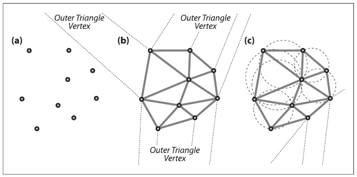
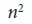
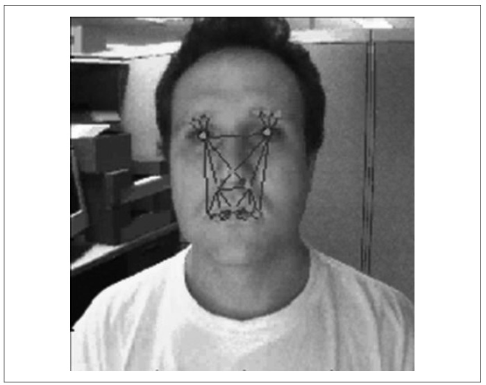
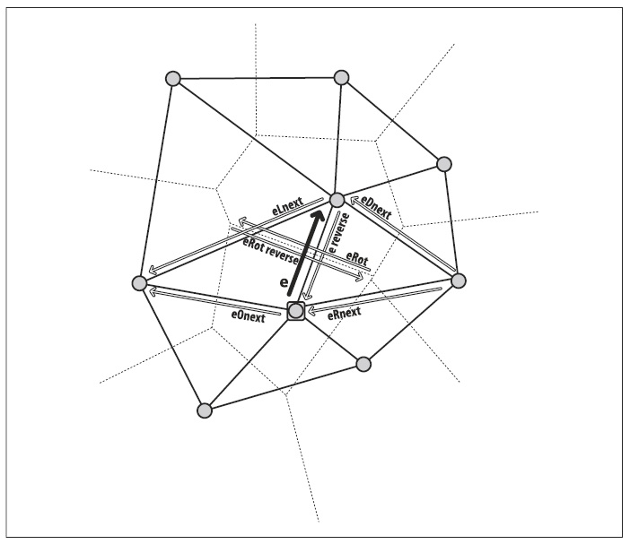
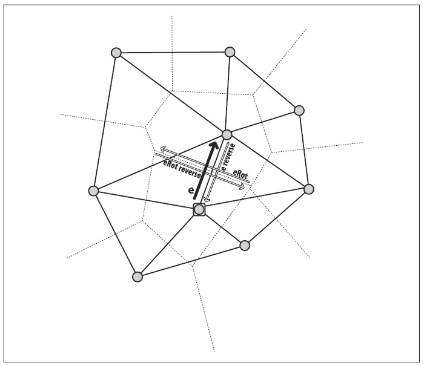

## (П]|(РС)|(РП) Триангуляция Delaunay, тесселяция Voronoi

*Триангуляция Delaunay* - это техника, изобретенная в 1934 для соединения точек в пространстве в треугольную группу таким образом, чтобы минимальный угол среди всех углов в триангуляции был максимальным. Это означает, что триангуляция Delaunay пытается избегать "тонких" треугольников при триангуляции точек. Для того чтобы понять суть триангуляции посмотрите на рисунок 9-12: любая окружность, описанная вокруг вершин любого треугольника не содержит других вершин. Это называется *свойство описанной окружности* (часть c на рисунке).

Для вычислительной эффективности, алгоритм Delaunay начинает свою работу с самого далекого внешне ограничивающего треугольника. На рисунке 9-12(b) фиктивный внешний треугольник представлен пунктирными линиями, сходящимся в вершине. На рисунке 9-12(c) представлено несколько примеров описанных окружностей, при этом один из них связывает две реальные вершины и одну из вершин фиктивного внешнего треугольника.



Рисунок 9-12. Триангуляция Delaunay: (a) множество точек; (b) Триангуляция Delaunay для набора точек, с пунктирными линиями до внешнего ограничивающего треугольника; (c) пример описанных окружностей

На сегодняшний день существует множество алгоритмов для расчета триангуляции Делоне; некоторые из них очень эффективные, но со сложными деталями реализации. Суть одного из наиболее простых алгоритмов в следующем:

1. Добавить внешний треугольник и начать с одной из его вершин (это дает точную внешнюю отправную точку)
2. Добавить внутреннюю точку; затем "пройтись" по всем треугольникам с описанной окружностью содержащих эту точку и удалить эти триангуляции
3. Re-triangulate график, включая новые точки в описанную окружность простым удалением триангуляций.
4. Возвращаться к шагу 2 до тех пор, пока не останется точек для добавления.

Сложность этого алгоритма составляет O(). Наиболее эффективные алгоритмы (в среднем) имеют сложность O(n log log n).

Отлично – но для чего все это нужно? С одной стороны, нужно помнить, что этот алгоритм начинает свою работу с фиктивного внешнего треугольника, поэтому все настоящие внешние точки, на самом деле, соединены с двумя вершинами этого треугольника. Так, а описанная окружности - это окружность, проходящая через две реальные внешние точки и одну фиктивную внешнюю вершину, не содержит других внутренних вершин. Это означает, что компьютер сможет определить, какие реальные точки образуют внешний контур набора точек, просто просмотрев те точки, которые соединены с тремя внешними фиктивными вершинами. Другими словами, можно найти скелет набора точек сразу после того, как будет выполнена триангуляция Delaunay. 

Так же можно определить, кто "владеет" пространством между точками, а именно, чьи координаты являются ближайшими соседями до вершин Delaunay. Таким образом, используя триангуляцию Delaunay, можно найти ближайшего соседа для новой точки. Такое разбиение на плоскости называется *тесселяция Voronoi*. Тесселяция является двойным образом триангуляции Delaunay, потому что линии Delaunay определяют расстояние между существующими точками, а линии Voronoi  «знают», где они должны пересекаться с линиями Delaunay для сохранения равного расстояния между точками. Эти два метода для нахождения выпуклой оболочки и ближайшего соседа, являются основными операциями кластеризации и классификации точек и наборов точек.


Рисунок 9-13. Тесселяция Voronoi, в результате которой все точки в пределах данной ячейки Voronoi являются ближайшими к своим точкам Delaunay, чем к любым другим точкам Delaunay: (a) триангуляция Delaunay жирными линиями и соответствующая тесселяции Voronoi тонкими линиями, (b) ячейки Voronoi вокруг каждой точки Delaunay.

Все те, кто знаком с 3D графикой может заметить, что триангуляция Delaunay зачастую используется как основа для представления 3D фигур. Если имеется 3D представление объекта, то можно создать 2D представление этого объекта с помощью проекции, а затем использовать триангуляцию Delaunay для анализа и идентификации объекта и/или для сравнения его с реальным объектом. Триангуляция Delaunay это связующее звено между компьютерным зрением и компьютерной графикой. Однако, триангуляция Delaunay в OpenCV выполняется только для двумерного измерения (в дальнейшем планируется это исправить, глава 14). Если бы существовала возможность триангулировать множество 3D точек – скажем для стереозрения (глава 11) – то можно было бы плавно переходить между 3D графикой и компьютерным зрением. Тем не менее, 2D триангуляция Delaunay часто используется в компьютерном зрении для того, чтобы зарегистрировать пространственное расположение особенностей на объекте или сцене для отслеживания движений, распознавания объектов или для сравнения проекций с двух разных камер (при выводе глубины стереозрения). На рисунке 9-14 показано, как можно отслеживать и распознавать объекты при помощи триангуляции Delaunay, где ключевые точки лица пространственно классифицированы в соответствии с их триангуляцией.



Рисунок 9-14. Точки Delaunay могут быть использованы для слежения за объектами; здесь лицо отслеживается с помощью точек, по которым можно также определить эмоции

Теперь, когда установлена потенциальная полезность триангуляции Delaunay, но как собственно получить эту триангуляцию? Для решения этого задачи, OpenCV поставляется вместе с примером *.../opencv/samples/c/delaunay.c*. OpenCV ссылается на триангуляцию Delaunay как на подраздел Delaunay, критические и многоразовые части который будут рассмотрены в следующих разделах.

### Построение триангуляции Delaunay и тесселяции Voronoi

Для начала необходимо выделить место под хранение результатов триангуляции и тесселяции. Так же нужен внешний ограничивающий прямоугольник (чтобы ускорить вычисления, алгоритм должен работать с фиктивным внешним треугольником, расположенным за пределами ограничивающего прямоугольника). Что бы все это сделать, предположим, что точки располагаются внутри изображения 600x600:

```cpp
// Хранилище и структура для DELAUNAY SUBDIVISION
//
CvRect rect = { 0, 0, 600, 600 }; // Внешний ограничивающий прямоугольник
CvMemStorage* storage; // Хранилище
storage = cvCreateMemStorage(0); // Инициализация хранилища
CvSubdiv2D* subdiv; // The subdivision itself
subdiv = init_delaunay( storage, rect);
```

Код использует вызов функции *init_delaunay()*, которая является удобной "упаковкой" нескольких функций OpenCV:

```cpp
// инициализация удобной функции для DELAUNAY SUBDIVISION
//
CvSubdiv2D* init_delaunay(
    CvMemStorage* storage,
    CvRect rect
    ) {
        CvSubdiv2D* subdiv;
        subdiv = cvCreateSubdiv2D(
            CV_SEQ_KIND_SUBDIV2D,
            sizeof(*subdiv),
            sizeof(CvSubdiv2DPoint),
            sizeof(CvQuadEdge2D),
            storage
        );
        cvInitSubdivDelaunay2D( subdiv, rect ); // установка ограничительного прямоугольника
        return subdiv;
}
```

Далее необходима логика добавления точек. Эти точки должны быть типа float, 32F:

```cpp
CvPoint2D32f fp; // This is our point holder
for( i = 0; i < as_many_points_as_you_want; i++ ) {
    // However you want to set points
    //
    fp = your_32f_point_list[i];
    cvSubdivDelaunay2DInsert( subdiv, fp );
}
```

Можно конвертировать целые точки в 32f точки с помощью удобного макроса *cvPoint2D32f(double x, double y)* или *cvPointTo32f(CvPoint point)*, расположенного в *cxtypes.h*. Теперь, когда можно добавлять точки в триангуляцию Делоне, можно создавать и удалять соответствующую тесселяцию Вороного:

```cpp
cvCalcSubdivVoronoi2D( subdiv ); // Занести данные Voronoi в subdiv
cvClearSubdivVoronoi2D( subdiv ); // Удалить данные Voronoi из subdiv
```

В обеих функциях *subdiv* имеет тип *CvSubdiv2D**. Теперь можно создавать триангуляции Delaunay из 2-х мерных наборов точек с последующим созданием и удалением тесселяций Voronoi. Однако, как получить нужные данные из этих структур? Это можно сделать, шагая от ребра к вершине или от ребра к ребру в *subdiv*; на рисунке 9-15 показаны основные манёвры, начиная с данного ребра и его точки отсчета. Далее можно найти первые ребра или вершины двумя разными способами: (1) используя внешнюю точку для обнаружения ребра или вершин; или (2) шагая по последовательности вершин или рёбер. 

### Перемещение по подразделам Delaunay

Рисунок 9-15 сочетает в себе две структуры данных, которые будут использованы для перемещения по подразделам графа. 

Структура *cvQuadEdge2D* содержит набор из двух точек Delaunay и двух точек *Voronoi*, и связанные с ними рёбра (предполагается, что точки Voronoi и рёбра были рассчитаны с помощью *cvCalcSubdivVoronoi2D()*); рисунок 9-16. Структура *CvSubdiv2DPoint* содержит ребро Delaunay с сопутствующей вершиной, как показано на рисунке 9-17. Структура из четырёх рёбер определена в соответствии с рисунком.



Рисунок 9-15. Ребра относительно данного ребра, с меткой "e", и его вершина (отмечена квадратом)



Рисунок 9-16. Quad edges, к которым можно получить доступ при помощи cvSubdiv2DRotateEdge(), включая ребро Delaunay и противоположное ему ребро, а также соответствующие рёбра и вершины Voronoi


Рисунок 9-17. CvSubdiv2DPoint вершина и связанное с ней ребро e, вместе с другими связанными рёбрами, которые могут быть получены с помощью cvSubdiv2DGetEdge()

```cpp
// Рёбра представляют собой длинные целые числа. Младшие два бита
// это их индекс (0..3), а старшие - quad-edge указатель.
// 
typedef long CvSubdiv2DEdge;

// поля структуры quad-edge
//
#define CV_QUADEDGE2D_FIELDS() 
    int flags; 
    struct CvSubdiv2DPoint* pt[4]; 
    CvSubdiv2DEdge next[4];
 
typedef struct CvQuadEdge2D {
    CV_QUADEDGE2D_FIELDS()
} CvQuadEdge2D;
```

Точки подраздела Delaulay и соответствующая структура ребра определяется следующим образом:

```cpp
#define CV_SUBDIV2D_POINT_FIELDS() 
    int flags; 
    CvSubdiv2DEdge first; /*The edge "e" in the figures.*/
    CvPoint2D32f pt;
 
#define CV_SUBDIV2D_VIRTUAL_POINT_FLAG (1 << 30)
 
typedef struct CvSubdiv2DPoint
{
    CV_SUBDIV2D_POINT_FIELDS()
}
CvSubdiv2DPoint;
```

С помощью этих структур, можно рассмотреть различные способы перемещения по вершинам и рёбрам.

**Обход рёбер**

Как показано на рисунке 9-16, перемещаться между четырьмя ребрами можно используя следующую функцию:

```cpp
CvSubdiv2DEdge cvSubdiv2DRotateEdge(
 CvSubdiv2DEdge edge
,int type
);
```

При наличии *edge* (ребра) получить следующее ребро можно используя аргумент *type*, который принимает одно из следующих значений:

* 0, исходное ребро (*e* на фигуре, если *e* исходное ребро)

* 1, поворотное ребро (*eRot*)

* 2, противоположное ребро (противоположное *e*)

* 3, противоположное поворотному ребру (противоположное *eRot*)

Ссылаясь на рисунок 9-17, так же возможно обойти граф Delaunay при помощи следующей функции:

```cpp
CvSubdiv2DEdge cvSubdiv2DGetEdge(
 CvSubdiv2DEdge edge
,CvNextEdgeType type
);
 
#define cvSubdiv2DNextEdge( edge )
cvSubdiv2DGetEdge(
 edge
,CV_NEXT_AROUND_ORG
)
```

Аргумент *type* может принимать следующие значения:

*CV_NEXT_AROUND_ORG*
Следующее от исходного ребро (*eOnext* на рисунке 9-17, если *e* исходное ребро)

*CV_NEXT_AROUND_DST*
Ребро следующей вершины (*eDnext*)

*CV_PREV_AROUND_ORG*
Предыдущее от исходного ребро (противоположное *eRnext*)

*CV_PREV_AROUND_DST*
Предыдущее от ребра назначения (противоположное *eLnext*)

*CV_NEXT_AROUND_LEFT*
Следующее от левой грани (*eLnext*)

*CV_NEXT_AROUND_RIGHT*
Следующее от правой грани (*eRnext*)

*CV_PREV_AROUND_LEFT*
Предыдущее от левой грани (противоположное *eOnext*)

*CV_PREV_AROUND_RIGHT*
Предыдущее от правой грани (противоположное *eDnext*)

Стоит отметить, что указанное ребро связано с вершиной и потому можно использовать удобный макрос *cvSubdiv2DNextEdge( edge )*, чтобы найти все остальные ребра от этой вершины. Это полезно использовать в случае с выпуклой оболочкой, начинающейся из вершины внешнего (фиктивного) треугольника.

Важными видами обхода являются *CV_NEXT_AROUND_LEFT* и *CV_NEXT_AROUND_RIGHT*. Их можно использовать для обхода треугольника Delaunay, если находиться на ребре Delaunay или для обхода ячеек Voronoi, если находиться на ребре Voronoi.

**Точки ребер**

Помимо всего прочего, необходимо знать, как получать фактические точки из вершин Delaunay или Voronoi. Каждое ребро Delaunay или Voronoi имеет две точки, связанные с ним: *org* - исходная точка и *dst* - конечная точка. Эти точки легко можно получить при помощи следующих функций:

```cpp
CvSubdiv2DPoint* cvSubdiv2DEdgeOrg( CvSubdiv2DEdge edge );
CvSubdiv2DPoint* cvSubdiv2DEdgeDst( CvSubdiv2DEdge edge );
```

Следующий метод можно использовать для преобразования *CvSubdiv2DPoint* в более привычный вид:

```cpp
CvSubdiv2DPoint ptSub; // Вершина для преобразования
CvPoint2D32f pt32f = ptSub->pt; // преобразование к типу 32f
CvPoint pt = cvPointFrom32f(pt32f); // преобразование к целочисленному типу
```

На данный момент должно было сформироваться представление о структуре подраздела и о том, как совершать обход его вершин и ребер. Теперь можно вернуться к рассмотрению методов получения исходных ребер и вершин подразделов Delaunay/Voronoi.

**Метод 1: использование внешних точек для нахождения ребер и вершин**

Первый метод начинает свою работу с произвольной точки и поиска её местоположения в данном подразделе. Это необязательно должна быть точка, которая уже триангулирована; это может быть любая точка. Функция *cvSubdiv2DLocate()* занимает одно ребро и одну вершину (если необходимо) треугольника или грани Voronoi, в который эта точка упала. 

```cpp
CvSubdiv2DPointLocation cvSubdiv2DLocate(
 CvSubdiv2D* subdiv
,CvPoint2D32f pt
,CvSubdiv2DEdge* edge
,CvSubdiv2DPoint** vertex = NULL
);
```

Стоит обратить внимание на тот факт, что это не обязательно должны быть ближайшие *edge* (ребро) или *vertex* (вершина); достаточно будет и того, чтобы они были на треугольнике или гране. Возвращаемое значение данной функции сообщает о состоянии попадания точки.

*CV_PTLOC_INSIDE*
Точка попадает на некую грань; **edge* будет содержать одно из ребер грани

*CV_PTLOC_ON_EDGE*
Точка попадает на ребро; **edge* будет содержать это ребро

*CV_PTLOC_VERTEX*
Точка совпадает с одной из вершин подраздела; **vertex* будет содержать указатель на вершину

*CV_PTLOC_OUTSIDE_RECT*
Точка находится за пределами прямоугольника; функция вернет не заполненный указатель

*CV_PTLOC_ERROR*
Один из исходных аргументов является недействительным

**Метод 2: последовательный обход точек и ребер**

Удобен в использование подраздел Delaunay, созданный из множества точек; его первые три точки и ребра образуют вершины и стороны фиктивного внешнего ограничивающего треугольника. Из этого сразу можно получить доступ к внешним точкам и ребрам, которые формируют выпуклую оболочку из фактических точек данных. После создания подраздела Delaunay (*subdiv*), необходимо вызвать *cvCalcSubdivVoronoi2D( subdiv )* для того, чтобы рассчитать связанную с ним тесселяцию Voronoi. Получить доступ к трем вершинам внешнего ограничивающего треугольника можно следующим образом:

```cpp
CvSubdiv2DPoint* outer_vtx[3];
for( i = 0; i < 3; i++ ) {
outer_vtx[i] =
(CvSubdiv2DPoint*)cvGetSeqElem( (CvSeq*)subdiv, I );
}
```

Аналогичным образом можно получить три стороны внешнего ограничительного треугольника:

```cpp
CvQuadEdge2D* outer_qedges[3];
for( i = 0; i < 3; i++ ) {
outer_qedges[i] =
(CvQuadEdge2D*)cvGetSeqElem( (CvSeq*)(my_subdiv->edges), I );
}
```

Теперь, зная как построить граф и как по нему перемещаться, необходимо научиться определять местоположение – на внешнем краю или границе точек.

**Определение ограничивающего треугольника, или краев выпуклой оболочки и её обход**

Ограничивающий прямоугольник *rect* используется для инициализации триангуляции Delaunay при помощи функции *cvInitSubdivDelaunay2D( subdiv, rect )*. В таком случае, справедливы следующие утверждения:

1. Если имеется ребре, у которого и исходная и конечная точки находятся вне границ *rect* (прямоугольника), тогда ребро принадлежит фиктивному ограничивающему треугольнику подраздела.

2. если одна из точек ребра находится внутри, а другая за пределами границ *rect* (прямоугольника), то точка границы находиться находится в выпуклой оболочке множества; каждая точка выпуклой оболочки связан с двумя вершинами фиктивного внешнего ограничивающего треугольника и эти два ребра следуют друг за другом.

Для второго условия можно использовать *cvSubdiv2DNextEdge()*, чтобы перейти на первое ребро, у которого точка *dst* находится в пределах границ. После попадания на выпуклую оболочку, по ней можно перемещаться следующим образом:

1. Пока не произошел обход всей выпуклой оболочки, перейти к следующему ребру оболочки при помощи *cvSubdiv2DRotateEdge(CvSubdiv2DEdge edge, 0)*.

2. Другие два вызова *cvSubdiv2DNextEdge()* дает следующие ребра выпуклой оболочки. Вернуться к шагу 1.

На данный момент было рассмотрено, как инициализировать подразделы Delaunay и Voronoi, как искать исходные ребра, а также как совершать обход ребер и вершин графа. В следующем разделе будет представлено практическое применение рассмотренного материала.

### Примеры использования

Можно использовать *cvSubdiv2DLocate()* для обхода ребер треугольника Delaunay:

```cpp
void locate_point(
 CvSubdiv2D* subdiv
,CvPoint2D32f fp
,IplImage* img
,CvScalar active_color
) {
CvSubdiv2DEdge e;
CvSubdiv2DEdge e0 = 0;
CvSubdiv2DPoint* p = 0;
cvSubdiv2DLocate( subdiv, fp, &e0, &p );
if( e0 ) {
e = e0;

// Всегда 3 ребра – это ведь триангуляция.
//
do {
// [Вставте свой код сюда]
//
// Сделать что-то с e …
e = cvSubdiv2DGetEdge(e,CV_NEXT_AROUND_LEFT);
}
while( e != e0 );
}
}
```

Найти ближайшие точки исходной точки можно при помощи

```cpp
CvSubdiv2DPoint* cvFindNearestPoint2D(
 CvSubdiv2D* subdiv
,CvPoint2D32f pt
);
```

В отличие от *cvSubdiv2DLocate()*, *cvFindNearestPoint2D()* возвращает ближайшую точку вершины в подразделе Delaunay. Не гарантировано, что точка обязательно попадет на грань или треугольник.

Аналогичным образом можно обойти грань Voronoi при помощи

```cpp
void draw_subdiv_facet(
IplImage *img,
CvSubdiv2DEdge edge
) {
CvSubdiv2DEdge t = edge;
int i, count = 0;
CvPoint* buf = 0;

// Подсчет количества ребер на грани
do{
count++;
t = cvSubdiv2DGetEdge( t, CV_NEXT_AROUND_LEFT );
} while (t != edge );

// Сбор точек
//
buf = (CvPoint*)malloc( count * sizeof(buf[0]))
t = edge;
for( i = 0; i < count; i++ ) {
CvSubdiv2DPoint* pt = cvSubdiv2DEdgeOrg( t );
if( !pt ) break;
buf[i] = cvPoint( cvRound(pt->pt.x), cvRound(pt->pt.y));
t = cvSubdiv2DGetEdge( t, CV_NEXT_AROUND_LEFT );
}

// Обход
//
if( i == count ){
CvSubdiv2DPoint* pt = cvSubdiv2DEdgeDst(
cvSubdiv2DRotateEdge( edge, 1 ));
cvFillConvexPoly( img, buf, count,
CV_RGB(rand()&255,rand()&255,rand()&255), CV_AA, 0 );
cvPolyLine( img, &buf, &count, 1, 1, CV_RGB(0,0,0),
1, CV_AA, 0);
draw_subdiv_point( img, pt->pt, CV_RGB(0,0,0));
}
free( buf );
}
```

И в заключение, есть ещё один способ получения доступа к подразделу, используя *CvSeqReader* для перебора последовательности ребер. Перебор всех ребер Delaunay и Voronoi можно осуществить следующим образом:

```cpp
void visit_edges( CvSubdiv2D* subdiv){
CvSeqReader reader; // Последовательность reader
int i, total = subdiv->edges->total; // Количество ребер
int elem_size = subdiv->edges->elem_size; // размер ребра

cvStartReadSeq( (CvSeq*)(subdiv->edges), &reader, 0 );

cvCalcSubdivVoronoi2D( subdiv ); // убедиться, что существует

for( i = 0; i < total; i++ ) {

CvQuadEdge2D* edge = (CvQuadEdge2D*)(reader.ptr);

if( CV_IS_SET_ELEM( edge )) {
// Что-то сделать с ребрами Delaunay и Voronoi
//
CvSubdiv2DEdge voronoi_edge = (CvSubdiv2DEdge)edge + 1;
CvSubdiv2DEdge delaunay_edge = (CvSubdiv2DEdge)edge;

// … или сосредоточиться только на Voronoi

// левое
//
voronoi_edge = cvSubdiv2DRotateEdge( edge, 1 );

// правое
//
voronoi_edge = cvSubdiv2DRotateEdge( edge, 3 );
}
CV_NEXT_SEQ_ELEM( elem_size, reader );
}
}
```

И в заключение: выполнив поиск вершин, можно найти площадь треугольника

```cpp
double cvTriangleArea(
CvPoint2D32f a,
CvPoint2D32f b,
CvPoint2D32f c
)
```
