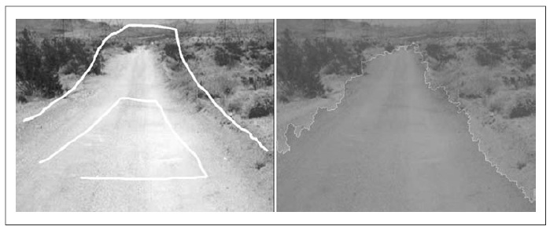
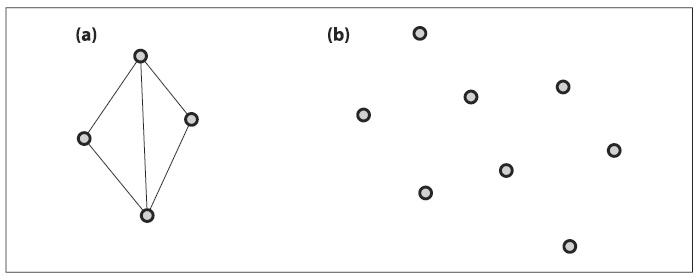

## (П]|(РС)|(РП) Упражнения

1. Используя функцию *cvRunningAvg()*, повторно реализуйте метод усреднения фона. Для того, чтобы сделать это, изучите скользящее среднее значение пикселей на сцене, чтобы найти абсолютную разницу среднего и скользящего среднего (*cvAbsDiff()*) в качестве прокси стандартного отклонения изображения.

2. Тени часто являются проблемой при вычитании фона, т.к. их можно принять за объекты переднего плана. Используйте метод вычитания фона усреднения или кодовой книги. Смоделируйте ситуацию, в которой человек перемещается на переднем плане. Тени будут "исходить" от нижней чатси объекта переднего плана.

	a. На улице тенями являются более темные и синеватые участки; используйте данный факт, что удалить тени.

	b. В помещение тенями являются более темные участки; используйте данный факт, чтобы удалить тени.

3. Простые модели фона, представленные в данной главе, зачастую весьма чувствительны к их пороговым параметрам. В главе 10 будет показано, как отслеживать движения, что может быть использовано в качестве "реальной" проверки модели фона и его порогов. Данные знания так же можно использовать, чтобы распознать человека по "калибровочным движениям" на переднем плане камеры: ищется движущийся объект и настраиваются параметры до тех пор, пока на переднем плане объект не будет соответствовать границам движения. Так же можно использовать определенные шаблоны на самом кадлиброванном объекте (или фоне) для реальной проверки и настройки направляющего, чтобы знать, что часть фона являеться замкнутой.

	a. Изменить код, чтобы включить режим автоколибровки. Изучите модель фона, а затем разместите цветной объект на сцене. Используйте цвет для поиска цветного объекта, а затем используйте этот объект, чтобы автматически устанавить пороговые значения фона для сегментации объекта. При этом можно оставить объект на сцене для плавной перестройки.

	b. Используйте полученное решение для удаления теней из упражнения 2.

4. Используйте фоновую сегментацию для сегментации человека с ружьем. Исследуйте влияние различных параметров и значений по умолчанию на процедуру *find_connected_components()*. отобразить результаты различных установок следующих параметров:

	a. *poly1_hull0*

	b. *perimScale*

	c. *CVCONTOUR_APPROX_LEVEL*

	d. *CVCLOSE_ITR*

5. В 2005 году на *DARPA Grand Challenge robot race*, авторы *Stanford team* использовали своего рода алгоритм цветной кластеризации для отделения дороги от не дороги. Цвета выбираются лазерной трапецией клочка дороги, взятой перед машиной. Другие цвета на сцены, близкие по цвету к данному клочку - это связанные компоненты и помечаются как дорога. Взгляните на рисунок 9-18, где алгоритм водораздела был использован для сегментации дороги, помеченная трапецией, а все что не дорога отмечено перевернутой "U". Предположим, что имеется возможность автоматически генерировать эти метки. Что может пойти не так в этом методе сегментции дороги?

	Подсказка: посмотрите на рисунок 9-8 и предположите за счет каких вещей можно расширить трапецию дороги

	

	Рисунок 9-18. Использование алгоритма водораздела для идентификации дороги: размещение маркеров на оригинальном изображение (слева) и результат алгоритма - сегментация дороги (справа)

6. Inpainting работает наиболее хорошо для восстановления письменного текста наиболее текстурироанных областей. Что будет, если письменный текст будет неразборчив? Попробуйте.

7. Это может быть немного медленно, однако попробуйте запустить фоновую сегментацию с предварительной предобработкой исходного видеопотока при помощи *cvPyrMeanShiftFiltering()*. Т.е. в начале на исходном потоке выполняется *mean-shift* сегментация, а затем выполнятеся изучение фона - а затем и тестирование переднего плана - при помощи метода кодовой книги.

	a. Отобразите результы до выполнения *mean-shift* сегментации.

	b. Попробуйте систематически изменять *max_level*, *spatialRadius* и *colorRadius* *mean-shift* сегментации. 

8. Насколько хорошо inpainting работает с письменным текстом, обработанным *mean-shift* сегментацией? Поэксперементируйте с настройками и отобразите результаты. 

9. Модифицируйте код *.../opencv/samples/delaunay.c* так, что бы появилась возможность отслеживания двойного нажатия мыши в указанном месте (вместо существующего метода, где место выбирается случайным образом). Поэксперементируйте с результатами триангуляции.

10. Вновь модифицируйте *delaunay.c* так, чтобы можно было бы задействовать клавиатуру для рисования выпуклой оболочки, на основе которой бы строилось множество точек.

11. Можно ли говорить о триангуляции Delaunay, имея три точик на линии?

12. Является ли триангуляция на рисунке 9-19(a) триангуляцией Delaunay? Если да, то объясните почему. Если нет, то как бы необходимо изменить фигуру, чтобы это была триангуляция Dekaunay?

13. Выполните триангуляцию Delaunay на множестве точек с рисунка 9-19(b) вручную. Для выполнения этого задания вам не потребуется внешний фиктивный внешний треугольник.

Рисунок 9-19. Упражнение 12 и 13