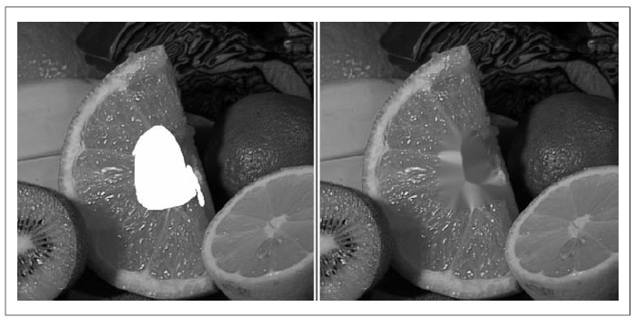

## [П]|[РС]|(РП) Восстановление изображения

Зачастую изображения повреждены шумом. Это может быть пыль или капли воды на линзах, царапины или испорченные части на старых фотографиях. *Inpainting* - это метод, который удаляет такого рода повреждения за счет копирования и смешивания цвета и текстур с границы поврежденных областей. На рисунке 9-9 показано как этот метод удаляет надпись с изображения.


Рисунок 9-9. Inpainting: изображение поврежденное текстом (слева) успешно восстановлено (справа)

*Inpainting* работает, если поврежденные области не слишком велики и текстур вокруг достаточно для их заполнения. На рисунке 9-10 показано что произойдет, если поврежденная область слишком велика.



Рисунок 9-10. Inpainting не может магически восстанавливать текстуры, которые полностью повреждены: центр апельсина полностью уничтожен (слева), эта область заполняется преимущественно оранжевой текстурой (справа)

Прототип функции *cvInpaint()*:

```cpp
void cvInpaint(
 const CvArr* 	src
,const CvArr* 	mask
,CvArr* 	dst
,double 	inpaintRadius
,int 		flags
);
```

*src* - это 8-битное одноканальное серое или трехканальное цветное изображение, которое должно быть восстановлено и *mask* - 8-битное одноканальное изображение того же размера, что и *src*, и в котором поврежденные области (например надпись на рисунке 9-9) помечены ненулевыми пикселями; остальные пиксели равны 0. Конечное изображение будет записано в *dst*, которое должно быть того же размера и с тем же количеством каналов, что и *src*. *inpaintRadius* это область вокруг каждого восстанавливаемого пикселя, от значений которой зависит цвет результирующего пикселя. Как показано на рисунке 9-10, внутренние пиксели достаточно большой восстанавливаемой области могут полностью позаимствовать цвет от других пикселей, лежащих возле границ. Почти всегда используют небольшой радиус, например 3, потому что большой радиус приводит к появлению заметного размытия. Аргумент *flags* позволяет задавать метод восстановления: *CV_INPAINT_NS* (метод Navier-Stokes) или *CV_INPAINT_TELEA* (метод A. Telea’s)