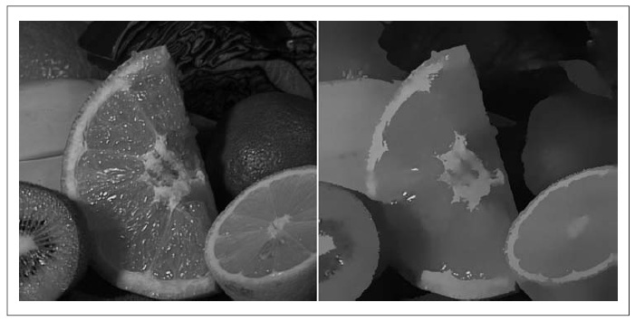

## [П]|[РС]|(РП) Mean-Shift сегментация

В главе 5 уже была рассмотрена функция *cvPyrSegmentation()*. Пирамидальная сегментация использует цветовое смешивание (по шкале зависимости от цветового сходства) для сегментации изображения. Данный подход основан на минимизации "полной энергии" изображения; энергия определяет *прочность связей*, которые в свою очередь определяют *схожесть цветов*.  Данный раздел будет посвящен рассмотрению функции *cvPyrMeanShiftFiltering()*, которая реализует алгоритм, основанный на среднем сдвиге скопления цветов. Детали алгоритма среднего сдвига *cvMeanShift()* будут рассмотрены в главе 10, когда речь пойдет об алгоритме слежения за объектами. На данный момент достаточно будет знать, что алгоритм среднего сдвига ищет пики распределения цветного пространства (или другого признака) во времени. Сегментация методом среднего сдвига находит пики распределения цвета в пространстве. Общим у алгоритмов сегментации и слежения является то, что они оба полагаются на способность среднего сдвига находить режимы (пики) распределения.

Для множества многомерных точек (x, y, синий, зеленый, красный) алгоритм среднего сдвига может найти самую высокую плотность "сгустка" данных в данном пространстве при оконном сканировании над ним. Однако стоит обратить внимание на то, что пространственные переменные (x, y) могут сильно различаться в зависимости от величины цветового диапазона (синий, зеленый, красный). В данном случае необходимо иметь один радиус для пространственных переменных (*spatialRadius*) и ещё один для величины цвета (*colorRadius*). Средний сдвиг движущегося окна, все те точки которого сходятся в пике данных, становятся связанными или "принадлежащими" этому пику. Эта принадлежность, исходящая из самых плотных пиков, формирует сегментацию изображения. Сегментация на самом деле это градация пирамид (*cvPyrUp()*, *cvPyrDown()*), которая была описана в главе 5, поэтому цветовое скопление на верхних уровнях пирамид (съежившиеся изображения) имеют границы, уточненные пирамидами нижнего уровня. Вызов функции *cvPyrMeanShiftFiltering()* выглядит следующим образом:

```cpp
	void cvPyrMeanShiftFiltering(
		 const CvArr* src
		,CvArr* dst
		,double spatialRadius
		,double colorRadius
		,int max_level = 1
		,CvTermCriteria termcrit = cvTermCriteria(
										 CV_TERMCRIT_ITER | CV_TERMCRIT_EPS
										,5
										,1
									)
	);
```

У *cvPyrMeanShiftFiltering()* имеется исходное *src* и конечное *dst* изображения. Оба изображения должны быть 8-битными, трехканальными цветными изображениями одинакового размера. *spatialRadius* и *colorRadius* определяют, как алгоритм среднего сдвига оперирует средними цвета и пространства для формирования сегментации. Для 640x480 изображения, алгоритм показывает хорошие результаты для значений *spatialRadius* = 2 и *colorRadius* = 40. Аргумент *max_level* определяет количество уровней пирамид, которые будут использованы для сегментации. Для 640x480 изображения *max_level* равен 2 или 3.

Последний аргумент *CvTermCriteria* уже был рассмотрен в главе 8. Он используется во всех итеративных алгоритмах OpenCV. Значение по умолчанию дает довольно таки хорошие результаты и задается в случае, если параметр остался незаполненным. *cvTermCriteria* имеет следующий конструктор:

```cpp
	cvTermCriteria(
		 int 		type 	// CV_TERMCRIT_ITER, CV_TERMCRIT_EPS,
		,int 		max_iter
		,double 	epsilon
	);
```

Как правило, данная функция используется для генерации структуры *CvTermCriteria*. Первый аргумент может быть равен *CV_TERMCRIT_ITER* или *CV_TERMCRIT_EPS*, что указывает алгоритму завершать работу после некоторого фиксированного числа итераций или когда метрика сходимости достигнет некоторого малого значения (соответственно). Следующие два аргумента это значения, при котором или которых алгоритм должен быть завершен. Можно использовать оба значения, т.к. можно написать *type = CV_TERMCRIT_ITER | CV_TERMCRIT_EPS*, в этом случае алгоритм завершиться при одном из условий. Аргумент *max_iter* задаёт максимальное число итераций, если используется *CV_TERMCRIT_ITER*, тогда как *epsilon* устанавливает предел ошибки, если используется *CV_TERMCRIT_EPS*. Естественно точное значение *epsilon*зависит от алгоритма.

На рисунке 9-11 показан результат сегментации при использовании следующих значений:

```cpp
	cvPyrMeanShiftFiltering( src, dst, 20, 40, 2 );
```



Рисунок 9-11. Сегментация методом среднего сдвига при использовании функции *cvPyrMeanShift Filtering()* с параметрами max_level = 2, spatialRadius = 20, и colorRadius = 40; в результате схожие области имеют близкие значения и могут рассматриваться как супер пиксели, что может значительно ускорить последующую обработку