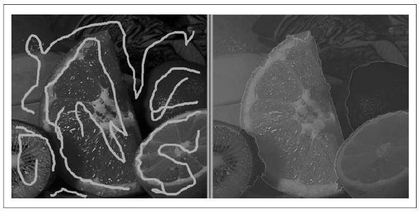

## [П]|[РС]|(РП) Алгоритм водораздела

Во многих практических задачах возникает необходимость в сегментации изображения, но не с целью выделения фона на изображении. В таком случае лучше всего воспользоваться *алгоритмом водораздела*. Этот алгоритм конвертирует линии на изображении в "горы", а однородные регионы во "впадины"; все это может помочь при сегментации объекта. Работает алгоритм следующим образов: в начале берутся градиенты яркости изображения; за счет этого формируются впадины или *водоёмы* (низшие точки), где нет текстур и горы или *хребты* (высокие хребты соответствуют краям), что соответствует доминирующим линиям на изображении. Затем последовательно заливаются водоемы начиная с указанных пользователем (или алгоритмом) точек пока эти регионы не пересекутся. Регионы, которые объединяются по средствам отметок, генерируют сегменты, соотносящиеся друг с другом как изображения "заполнители". Таким образом регионы, связанные с точкой отметкой считаются "владельцами" этих отметок. В итоге изображение сегментируется в соответствии с помеченными регионами.

В результате алгоритм водораздела позволяет пользователю (или другому алгоритму!) помечать части объекта или фона как известные части объекта или фона. Пользователь или алгоритм может просто нарисовать линию и "сказать" алгоритму водораздела: "группируй данные точки вместе". За этим последует сегментация изображения, позволяющая отметить регионы "владеющие" краями хребтов в градиентных изображениях, связанные с сегментами. Рисунок 9-8 поясняет данный процесс.



Рисунок 9-8. Алгоритм водораздела: после того, как пользователь отметил объекты, которые связанны друг с другом (слева), алгоритм сливает отмеченные области в сегменты (справа)

Функция, реализующая алгоритм водораздела, выглядит следующим образом:

```cpp
	void cvWatershed(
	     const CvArr* 	image
	    ,CvArr* 		markers
	);
```

*image* - это 8-битное цветное (трехканальное) изображение, *markers* - это одноканальное целочисленное (*IPL_DEPTH_32S*) изображение, оба изображения имеют одинаковый размер; значения *markers* равны 0 за исключением тех мест, где пользователь (или алгоритм) указал (положительными числами), что регионы должны быть вместе. Например, слева на рисунке 9-8 апельсин может быть отмечен "1", лимон "2", лайм "3", а фон сверху "4" и т.д. В результате будет получена сегментация наподобие той, что представлена на том же изображении справа.